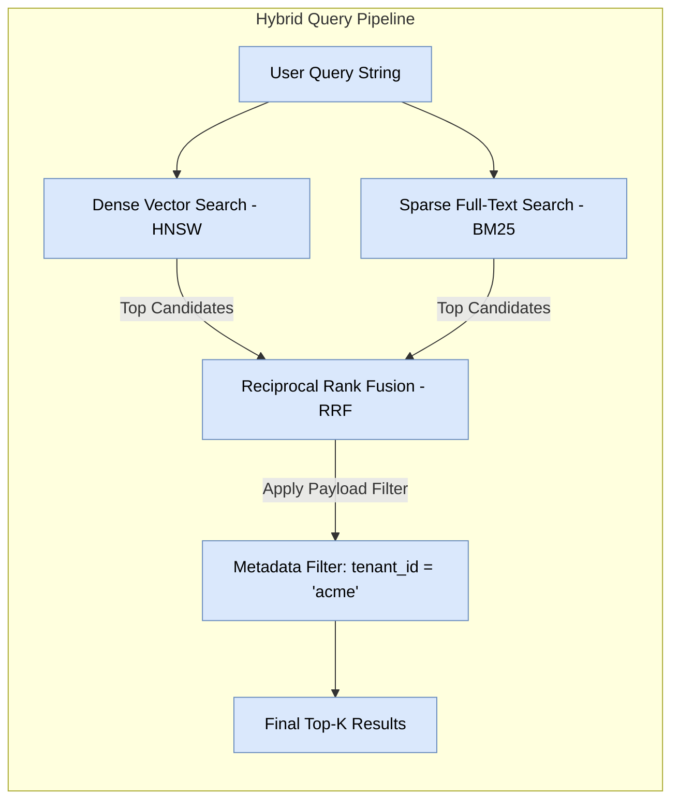

# Databricks AI Search (Mosaic AI Vector Search) Architecture & Guide

This document provides a technical guide to **Databricks AI Search** (formerly **Mosaic AI Vector Search**), the serverless vector database integrated into the Databricks Data Intelligence Platform.

---

## 1. Core Architecture & Workflow

Databricks AI Search indexes unstructured text directly from **Delta Lake tables** and serves similarity queries with sub-10ms latencies.

```mermaid
flowchart TD
    subgraph StorageLayer ["Delta Lake & Unity Catalog"]
        DeltaTab["Source Delta Table <br>&#40;CDF Enabled&#41;"]
        UC["Unity Catalog Governance <br>&#40;ACLs, Row Filters&#41;"]
    end

    subgraph SyncEngine ["Delta Sync Engine"]
        CDF["Change Data Feed"] --> SyncJob["Auto Sync Processor"]
        SyncJob -->|Managed Embedding API| LLM["databricks-bge-large-en"]
        LLM -->|Generate Vectors| Index["HNSW + BM25 Hybrid Index"]
    end

    subgraph ServingLayer ["Serverless Compute"]
        Endpoint["AI Search Endpoint <br>&#40;Serverless REST API&#41;"]
        Endpoint <--> Index
    end

    DeltaTab --> CDF
    DeltaTab --- UC
    Endpoint --- UC

    classDef storageStyle fill:#e2f0d9,stroke:#385723,stroke-width:1px,color:#000;
    classDef syncStyle fill:#fff2cc,stroke:#d6b656,stroke-width:2px,color:#000;
    classDef serveStyle fill:#dae8fc,stroke:#6c8ebf,stroke-width:1px,color:#000;
    class DeltaTab,UC storageStyle;
    class CDF,SyncJob,LLM,Index syncStyle;
    class Endpoint serveStyle;
```



---

## 2. Key Features & Index Types

### A. Delta Sync Index (Automatic Synchronization)
Instead of building custom ETL upsert scripts, a **Delta Sync Index** listens to the source Delta table via **Change Data Feed (CDF)**.

- **Managed Embeddings**: Databricks computes vector embeddings automatically using a Foundation Model API endpoint (e.g., `databricks-bge-large-en`). When text rows are inserted or modified in Delta Lake, Databricks automatically embeds and updates the vector index.
- **Self-Managed Embeddings**: You pre-compute embeddings (e.g., via PySpark/DLT pipelines) and store them in an `ARRAY<FLOAT>` column. Databricks indexes the pre-computed vectors.

### B. Direct Vector Access Index
- Manually populated via REST API calls. Useful for real-time applications requiring direct write access outside of Delta Lake.

---

## 3. Search Mechanics: Hybrid Search & Filtering



1. **Hybrid Search (`query_type='hybrid'`)**:
   - Combines semantic vector distance (HNSW) with keyword matching (BM25).
   - Results are merged using **Reciprocal Rank Fusion (RRF)**. This prevents semantic search from missing exact product IDs, SKUs, or specialized domain terms.
2. **Metadata Payload Filtering**:
   - Allows SQL-like filtering during vector graph traversal (e.g., `category = 'finance' AND date >= '2025-01-01'`).
3. **Unity Catalog Security**:
   - Inherits workspace access control, row-level security, and audit logging directly from Unity Catalog.

---

## 4. Python Implementation Example

```python
from databricks.vector_search.client import VectorSearchClient

client = VectorSearchClient()

# 1. Create a Serverless Vector Search Endpoint
client.create_endpoint(
    name="prod_search_endpoint",
    endpoint_type="STANDARD"
)

# 2. Create a Delta Sync Index with Managed Embeddings
client.create_delta_sync_index(
    endpoint_name="prod_search_endpoint",
    index_name="main.rag_db.kb_docs_index",
    source_table_name="main.rag_db.parsed_chunks",
    pipeline_type="TRIGGERED", # or CONTINUOUS
    primary_key="chunk_id",
    embedding_source_column="chunk_text",
    embedding_model_endpoint_name="databricks-bge-large-en"
)

# 3. Perform Hybrid Search Query
index = client.get_index(endpoint_name="prod_search_endpoint", index_name="main.rag_db.kb_docs_index")

results = index.similarity_search(
    query_text="What are our Q1 sales targets?",
    columns=["chunk_id", "chunk_text", "document_title"],
    filters={"access_level": "internal"},
    num_results=5,
    query_type="hybrid"
)
```
