# Snowflake Access Control (RBAC) Architecture Specification
## Simple & Effective Lean Design with Secure Views

## 1. Executive Summary

This document defines a **Simple and Effective Access Control Architecture** for the Snowflake Data Cloud. Designed for centralized data teams, startups, and mid-sized organizations, this model strips away enterprise complexity while rigidly maintaining the core security best practices of **Role-Based Access Control (RBAC)**.

To support multiple business groups (e.g., Finance, Marketing) with different data access patterns without falling into the complexity trap of row-level security policies or multi-database data meshes, this architecture employs a **Secure View Data Mart Pattern**.

### 1.1 Core Security Principles

*   **Principle of Least Privilege:** Users and programmatic services are granted only the minimum necessary privileges required to perform their specific business functions.
*   **Zero Direct Grants to Users:** Database object privileges (e.g., `SELECT`, `INSERT`) are **never** granted directly to users. Privileges are granted to Access Roles, which are assigned to Functional Roles, which are assigned to users.
*   **Base Table Abstraction:** End-users and BI tools **never** query base tables directly. They only query **Secure Views** housed in domain-specific schemas, ensuring row-level and column-level isolation effortlessly.
*   **Centralized Storage & Compute:** A single, clean database structure (`ANALYTICS_DB`) and a minimal set of virtual warehouses (`ELT_WH` and `BI_WH`) drastically simplifies billing and access management.

---

## 2. System-Defined Roles Reference

Snowflake provides a set of system-defined, non-droppable roles. Understanding their boundaries is critical.

| System Role | Primary Responsibility | Best Practice Guidelines |
|---|---|---|
| **`ACCOUNTADMIN`** | The ultimate super-user role. Controls account-level parameters and billing. | **Limit to 2–3 users.** Enforce Multi-Factor Authentication (MFA). Never use as the default role for data pipelines. |
| **`SECURITYADMIN`** | Manages custom roles and inherits the global `MANAGE GRANTS` privilege. | Use strictly for security operations. |
| **`USERADMIN`** | Dedicated role for creating and managing users and custom roles. | **This role should own all custom Functional and Access roles.** |
| **`SYSADMIN`** | Owns and manages all compute and storage resources. | All custom roles must roll up to `SYSADMIN`. |
| **`PUBLIC`** | A pseudo-role automatically assigned to every user. | **Revoke all default privileges from `PUBLIC`.** Do not grant any privileges to this role. |

---

## 3. The Lean Dual-Layer RBAC Architecture

To decouple your physical database structure from your human organizational changes, we use the industry-standard **Dual-Layer RBAC Model**:

```
[ Secure View Privilege ] ──> [ Access Role (AR) ] ──> [ Functional Role (FR) ] ──> [ User ]
```

### 3.1 Access Roles (AR)
Access Roles are **technical roles** that map directly to specific schemas. They are **never** assigned directly to users.
*   **Naming Convention:** `<SCHEMA>_<PRIVILEGE>`
*   **The Simplified Matrix:**
    *   `CORE_WRITE`: Can build and write to the base `CORE` schema (for Data Engineering).
    *   `FINANCE_READ`: Can read from the `FINANCE_SECURE` schema.
    *   `MARKETING_READ`: Can read from the `MARKETING_SECURE` schema.

### 3.2 Functional Roles (FR)
Functional Roles represent **business personas or programmatic applications**. They are assigned directly to users or service accounts, and inherit Access Roles.
*   **Naming Convention:** `<PERSONA>` or `SVC_<APPLICATION>`
*   **The Simplified Matrix:**
    *   `DATA_ENGINEER`: Has broad read/write access to build pipelines and create secure views.
    *   `FINANCE_ANALYST`: Inherits `FINANCE_READ`.
    *   `MARKETING_ANALYST`: Inherits `MARKETING_READ`.
    *   `SVC_DBT`: Service account for data transformation (writes to `CORE`, creates Secure Views).
    *   `SVC_BI`: Service account for BI tools. Can be granted multiple Access Roles depending on the dashboards it serves.

---

## 4. Visual Architecture Diagrams

### 4.1 Simplified Role Hierarchy

This diagram illustrates how our lean set of custom roles roll up to the central `SYSADMIN` role for easy, unified governance, and how business groups are separated.

```mermaid
flowchart TD
    %% System Roles
    ACCOUNTADMIN["ACCOUNTADMIN <br>&#40;Super-User / Billing&#41;"]
    SECURITYADMIN["SECURITYADMIN <br>&#40;Grants / Security&#41;"]
    USERADMIN["USERADMIN <br>&#40;User / Role Creator&#41;"]
    SYSADMIN["SYSADMIN <br>&#40;Infrastructure Owner&#41;"]

    %% Administrative Hierarchy
    ACCOUNTADMIN --> SECURITYADMIN
    SECURITYADMIN --> USERADMIN
    ACCOUNTADMIN --> SYSADMIN

    subgraph FR_Layer [Functional Roles: Personas & Services]
        direction TB
        DE["DATA_ENGINEER"]
        FA["FINANCE_ANALYST"]
        MA["MARKETING_ANALYST"]
        SVC_DBT["SVC_DBT"]
    end

    subgraph AR_Layer [Access Roles: Schema Access]
        direction TB
        CORE_W["CORE_WRITE"]
        FIN_R["FINANCE_READ"]
        MKT_R["MARKETING_READ"]
    end

    %% Rollups to SYSADMIN
    SYSADMIN --> DE
    SYSADMIN --> FA
    SYSADMIN --> MA
    SYSADMIN --> SVC_DBT

    %% Mappings
    DE --> CORE_W
    SVC_DBT --> CORE_W
    
    FA --> FIN_R
    MA --> MKT_R

    %% Style classes
    classDef system fill:#1f4e79,stroke:#fff,stroke-width:2px,color:#fff;
    classDef functional fill:#2e75b6,stroke:#fff,stroke-width:1px,color:#fff;
    classDef access fill:#8faadc,stroke:#000,stroke-width:1px,color:#000;
    
    class ACCOUNTADMIN,SECURITYADMIN,USERADMIN,SYSADMIN system;
    class DE,FA,MA,SVC_DBT functional;
    class CORE_W,FIN_R,MKT_R access;
```



### 4.2 The Secure View Abstraction Flow

This diagram tracks how a Marketing Analyst queries a Secure View, abstracting them away from the base `CORE` tables where PII or Finance data might reside.

```mermaid
flowchart LR
    subgraph Data [Storage Layer: CORE]
        Table["Base Table: analytics_db.core.transactions <br>&#40;Contains All Data&#41;"]
    end

    subgraph Views [Data Mart Layer: MARKETING_SECURE]
        View["Secure View: mkt_transactions_v <br>&#40;Filters WHERE domain='MKT'&#41;"]
    end

    subgraph Access [Access Role]
        AR["MARKETING_READ <br>&#40;SELECT on Views&#41;"]
    end

    subgraph Compute [Compute Layer]
        WH["BI_WH <br>&#40;USAGE privilege&#41;"]
    end

    subgraph Func [Functional Role]
        FR["MARKETING_ANALYST"]
    end

    %% Mappings
    Table -.->|Abstracted Behind| View
    View -.->|Grant SELECT| AR
    AR -->|Inherited by| FR
    WH -->|Grant USAGE| FR
    
    %% Style classes
    classDef storage fill:#e2f0d9,stroke:#385723,stroke-width:1px,color:#000;
    classDef view fill:#c6e0b4,stroke:#385723,stroke-width:1px,color:#000;
    classDef access fill:#8faadc,stroke:#000,stroke-width:1px,color:#000;
    classDef compute fill:#fff2cc,stroke:#d6b656,stroke-width:1px,color:#000;
    classDef functional fill:#2e75b6,stroke:#fff,stroke-width:1px,color:#fff;

    class Table storage;
    class View view;
    class AR access;
    class WH compute;
    class FR functional;
```



---

## 5. Centralized Storage & Secure Views

### 5.1 Single Analytics Database
We centralize all operations into a single standard database `ANALYTICS_DB` utilizing a layered schema approach:
1.  **`RAW`:** Untouched ingestion data.
2.  **`CORE`:** Clean, modeled data (The "Gold" base tables). **End users are strictly denied access to this schema.**
3.  **`FINANCE_SECURE`:** Contains Secure Views curated specifically for the Finance team.
4.  **`MARKETING_SECURE`:** Contains Secure Views curated specifically for the Marketing team.

### 5.2 The Secure View Pattern
By creating a `SECURE VIEW` instead of a standard view, Snowflake prevents users from viewing the underlying view definition (the SQL code that created it). This stops users from reverse-engineering the view to uncover filtered data or PII logic.

**Example: Subsetting Data for Marketing**
```sql
CREATE SECURE VIEW analytics_db.marketing_secure.mkt_transactions_v AS
SELECT 
    transaction_id,
    customer_id,
    revenue,
    -- Hide PII like emails from marketing analysts
    '***MASKED***' as customer_email 
FROM analytics_db.core.transactions
WHERE business_domain = 'MARKETING';
```

### 5.3 Managed Access Schemas & Future Grants
All schemas must be created as **Managed Access Schemas** (`WITH MANAGED ACCESS`). This centralizes security control. 
To eliminate manual scripting overhead, we utilize **Future Grants** at the schema level. When dbt creates a new view in `FINANCE_SECURE`, the `FINANCE_READ` role will automatically receive `SELECT` privileges on it instantly.

---

## 6. Simplified Compute Security

We reduce warehouse complexity to exactly what is needed, isolating heavy ETL processing from user-facing dashboards.

| Warehouse | Assigned Size | Auto-Suspend | Target Concurrency | Granted To |
|---|---|---|---|---|
| `ELT_WH` | Small | 60 sec | Batch loading, transformations | `SVC_DBT`, `DATA_ENGINEER` |
| `BI_WH` | X-Small | 60 sec | Interactive Queries, Dashboards | `FINANCE_ANALYST`, `MARKETING_ANALYST`, `SVC_BI` |

---

## 7. The 2-Minute Secure View Bootstrap Script

This single SQL script can be copy-pasted and executed by an `ACCOUNTADMIN` or `SECURITYADMIN` to bootstrap the entire simple, secure architecture from scratch.

```sql
-- ============================================================================
-- SNOWFLAKE LEAN RBAC BOOTSTRAP SCRIPT (SECURE VIEW PATTERN)
-- RUN AS: SECURITYADMIN (or ACCOUNTADMIN)
-- ============================================================================

USE ROLE SECURITYADMIN;

-- 1. CLEAN UP DEFAULT PRIVILEGES (ZERO-TRUST BASELINE)
REVOKE ALL PRIVILEGES ON FUTURE SCHEMAS IN DATABASE snowflake FROM ROLE PUBLIC;

-- 2. CREATE WAREHOUSES
USE ROLE SYSADMIN;
CREATE WAREHOUSE IF NOT EXISTS ELT_WH WITH WAREHOUSE_SIZE = 'SMALL' AUTO_SUSPEND = 60 AUTO_RESUME = TRUE INITIALLY_SUSPENDED = TRUE;
CREATE WAREHOUSE IF NOT EXISTS BI_WH WITH WAREHOUSE_SIZE = 'XSMALL' AUTO_SUSPEND = 60 AUTO_RESUME = TRUE INITIALLY_SUSPENDED = TRUE;

-- 3. CREATE DATABASE & SCHEMAS
CREATE DATABASE IF NOT EXISTS ANALYTICS_DB;
CREATE SCHEMA IF NOT EXISTS ANALYTICS_DB.RAW WITH MANAGED ACCESS;
CREATE SCHEMA IF NOT EXISTS ANALYTICS_DB.CORE WITH MANAGED ACCESS;
-- Data Mart Schemas (For Secure Views)
CREATE SCHEMA IF NOT EXISTS ANALYTICS_DB.FINANCE_SECURE WITH MANAGED ACCESS;
CREATE SCHEMA IF NOT EXISTS ANALYTICS_DB.MARKETING_SECURE WITH MANAGED ACCESS;

-- 4. CREATE ROLES
USE ROLE USERADMIN;
-- Access Roles
CREATE ROLE IF NOT EXISTS CORE_WRITE;
CREATE ROLE IF NOT EXISTS FINANCE_READ;
CREATE ROLE IF NOT EXISTS MARKETING_READ;
-- Functional Roles
CREATE ROLE IF NOT EXISTS DATA_ENGINEER;
CREATE ROLE IF NOT EXISTS FINANCE_ANALYST;
CREATE ROLE IF NOT EXISTS MARKETING_ANALYST;
CREATE ROLE IF NOT EXISTS SVC_DBT;
CREATE ROLE IF NOT EXISTS SVC_BI;

-- 5. GRANT SCHEMA & DATABASE ACCESS
USE ROLE SECURITYADMIN;
-- Database Usage
GRANT USAGE ON DATABASE ANALYTICS_DB TO ROLE CORE_WRITE;
GRANT USAGE ON DATABASE ANALYTICS_DB TO ROLE FINANCE_READ;
GRANT USAGE ON DATABASE ANALYTICS_DB TO ROLE MARKETING_READ;

-- Schema Usage (Write to Core, Read from Marts)
GRANT USAGE ON SCHEMA ANALYTICS_DB.RAW TO ROLE CORE_WRITE;
GRANT USAGE ON SCHEMA ANALYTICS_DB.CORE TO ROLE CORE_WRITE;
GRANT USAGE ON SCHEMA ANALYTICS_DB.FINANCE_SECURE TO ROLE FINANCE_READ;
GRANT USAGE ON SCHEMA ANALYTICS_DB.MARKETING_SECURE TO ROLE MARKETING_READ;
-- Allow Data Engineers / dbt to create views in the mart schemas
GRANT USAGE ON SCHEMA ANALYTICS_DB.FINANCE_SECURE TO ROLE CORE_WRITE;
GRANT USAGE ON SCHEMA ANALYTICS_DB.MARKETING_SECURE TO ROLE CORE_WRITE;

-- 6. SETUP FUTURE GRANTS (The Automation Magic)
-- WRITE operations for Core and Mart schemas
GRANT INSERT, UPDATE, DELETE, TRUNCATE ON FUTURE TABLES IN SCHEMA ANALYTICS_DB.CORE TO ROLE CORE_WRITE;
GRANT CREATE TABLE, CREATE VIEW ON SCHEMA ANALYTICS_DB.CORE TO ROLE CORE_WRITE;
GRANT CREATE VIEW ON SCHEMA ANALYTICS_DB.FINANCE_SECURE TO ROLE CORE_WRITE;
GRANT CREATE VIEW ON SCHEMA ANALYTICS_DB.MARKETING_SECURE TO ROLE CORE_WRITE;

-- READ operations for Business Group Secure Views
GRANT SELECT ON FUTURE VIEWS IN SCHEMA ANALYTICS_DB.FINANCE_SECURE TO ROLE FINANCE_READ;
GRANT SELECT ON FUTURE VIEWS IN SCHEMA ANALYTICS_DB.MARKETING_SECURE TO ROLE MARKETING_READ;

-- 7. MAP ACCESS ROLES TO FUNCTIONAL ROLES
-- Data Engineer and dbt build the pipeline
GRANT ROLE CORE_WRITE TO ROLE DATA_ENGINEER;
GRANT ROLE CORE_WRITE TO ROLE SVC_DBT;

-- Analysts get access to their respective Secure View schemas
GRANT ROLE FINANCE_READ TO ROLE FINANCE_ANALYST;
GRANT ROLE MARKETING_READ TO ROLE MARKETING_ANALYST;

-- BI Tool gets access to whatever dashboards it needs to serve
GRANT ROLE FINANCE_READ TO ROLE SVC_BI;
GRANT ROLE MARKETING_READ TO ROLE SVC_BI;

-- 8. GRANT WAREHOUSE USAGE
GRANT USAGE ON WAREHOUSE ELT_WH TO ROLE DATA_ENGINEER;
GRANT USAGE ON WAREHOUSE ELT_WH TO ROLE SVC_DBT;
GRANT USAGE ON WAREHOUSE BI_WH TO ROLE FINANCE_ANALYST;
GRANT USAGE ON WAREHOUSE BI_WH TO ROLE MARKETING_ANALYST;
GRANT USAGE ON WAREHOUSE BI_WH TO ROLE SVC_BI;

-- 9. ESTABLISH ROLLUP HIERARCHY
-- Everything rolls up to SYSADMIN to keep the environment perfectly auditable
GRANT ROLE DATA_ENGINEER   TO ROLE SYSADMIN;
GRANT ROLE FINANCE_ANALYST TO ROLE SYSADMIN;
GRANT ROLE MARKETING_ANALYST TO ROLE SYSADMIN;
GRANT ROLE SVC_DBT         TO ROLE SYSADMIN;
GRANT ROLE SVC_BI          TO ROLE SYSADMIN;

-- DONE! Your simple, secure-view driven architecture is deployed.
```

---

## 8. Operational Auditing Queries

Keep your lean environment secure by running these checks periodically.

### 8.1 Detect Base Table Access Violations
Ensure nobody has bypassed the Secure View structure by granting base `CORE` tables directly to analyst roles.
```sql
SELECT grantee_name AS role_name, name AS object_name, object_type, privilege
FROM SNOWFLAKE.ACCOUNT_USAGE.GRANTS_TO_ROLES
WHERE deleted_on IS NULL 
AND table_catalog = 'ANALYTICS_DB'
AND table_schema = 'CORE'
AND grantee_name IN ('FINANCE_READ', 'MARKETING_READ');
```
