# Boomi to Snowflake Integration Architecture

## 1. Executive Summary
This architecture defines the integration pattern for extracting data from enterprise systems (Salesforce and NetSuite) and loading it into Snowflake using **Dell Boomi AtomSphere**. It prioritizes resilience, scalability, and clear separation of concerns by employing an **ELT (Extract, Load, Transform)** approach. Boomi handles the "Extract & Load" orchestration, while Snowflake's native capabilities (like Dynamic Tables) handle the heavy lifting of the "Transform" phase.

## 2. Architecture Diagram

```mermaid
flowchart LR
    %% Styles
    classDef source fill:#e1f5fe,stroke:#0288d1,stroke-width:2px,color:#000;
    classDef boomi fill:#fff3e0,stroke:#f57c00,stroke-width:2px,color:#000;
    classDef storage fill:#f3e5f5,stroke:#7b1fa2,stroke-width:2px,color:#000;
    classDef snow fill:#e8eaf6,stroke:#3f51b5,stroke-width:2px,color:#000;

    subgraph Sources [Source Systems]
        direction TB
        SF[("Salesforce<br>(CRM)")]
        NS[("NetSuite<br>(ERP)")]
    end

    subgraph Middleware [Boomi AtomSphere]
        direction TB
        Start[/"Start Shape<br>(Listeners / Schedulers)"/]
        Process["Data Process<br>(Split / Route / Cleanse)"]
        Map["Map Shape<br>(Standardize to JSON/CSV)"]
        Target[/"Snowflake Connector<br>(Bulk Load)"/]

        Start --> Process --> Map --> Target
    end

    subgraph Snowflake [Snowflake Data Cloud]
        direction TB
        Stage[/"Snowflake Stage<br>(Internal or External)"/]
        Bronze[("Bronze Tables<br>(Raw Data)")]
        Silver[("Silver Tables<br>(Dynamic Tables)")]

        Stage -- "COPY INTO" --> Bronze
        Bronze -- "Target Lag" --> Silver
    end

    %% Connections
    SF -.->|"Push (Outbound Msg)<br>or Pull (SOQL)"| Start
    NS -.->|"Push (Event)<br>or Pull (SuiteTalk)"| Start
    Target == "JDBC PUT API /<br>Bulk Load" ==> Stage

    %% Assign Styles
    class SF,NS source;
    class Start,Process,Map,Target boomi;
    class Stage storage;
    class Bronze,Silver snow;
```

## 3. Design Principles (The "Why")

### 3.1 ELT over ETL
**Why:** Boomi is highly effective at orchestrating data movement, managing connection authentication, and handling API pagination. However, complex data transformations (such as multi-table joins or massive aggregations) are resource-intensive to perform in memory on a Boomi Atom.
**Implementation:** Boomi performs minimal transformation. Its primary job is to extract complex, deeply nested XML/JSON from NetSuite and Salesforce, flatten it into standard payloads (JSON or CSV), and route it. All complex dimensional modeling occurs natively inside Snowflake using Dynamic Tables.

### 3.2 Stage-and-Load Pattern
**Why:** Directly inserting individual records into Snowflake via JDBC (`INSERT INTO`) causes massive performance bottlenecks, high compute costs, and metadata fragmentation due to transaction overhead.
**Implementation:** The Boomi Snowflake Connector natively leverages Snowflake's bulk load APIs. Under the hood, Boomi batches the documents, writes them to a Snowflake Stage using the `PUT` command, and then executes a `COPY INTO` command to load the data into the Bronze tables efficiently.

### 3.3 Decoupled Error Handling
**Why:** Source API failures, network blips, or data type mismatches should not halt the entire pipeline.
**Implementation:** 
- **Source Errors:** Handled by Boomi's `Try/Catch` shapes, which route failed extractions or network timeouts to a Boomi exception sub-process for logging or retry.
- **Ingestion Errors:** The `COPY INTO` command orchestrated by the connector utilizes `ON_ERROR = CONTINUE`. Any malformed records that fail to load into Bronze are captured later by a Snowflake Serverless Task and routed to a Dead Letter Queue (DLQ) for Data Engineering to audit.
