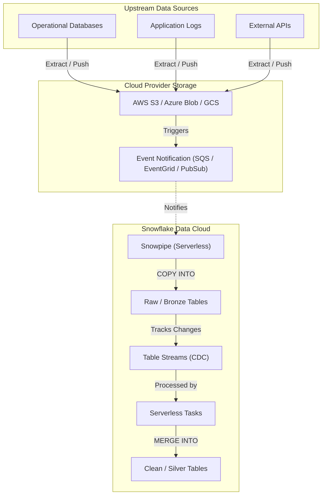

# Data Ingestion Architecture: Snowflake Native Platform

## 1. Executive Summary
This document outlines the Enterprise Data Ingestion Architecture designed specifically for Snowflake. The primary objective is to establish a **simple, robust, and low-maintenance** pipeline that moves data from external source systems into the Snowflake Data Cloud.

By aggressively leveraging Snowflake's native capabilities—specifically **Snowpipe** and **Serverless Tasks/Streams**—this architecture avoids the complexity, licensing costs, and operational overhead of third-party ETL/ELT orchestrators (e.g., Airflow, Fivetran) for standard ingestion workflows.

---

## 2. Ingestion Architectural Principles
1.  **ELT over ETL:** Data is ingested into Snowflake in its raw, native format (JSON, Parquet, CSV). All transformations occur *after* loading, utilizing Snowflake's highly scalable compute warehouses.
2.  **Serverless First:** We prioritize serverless features (Snowpipe, Serverless Tasks) to eliminate the need to manually manage, start, or stop virtual warehouses for background ingestion workloads.
3.  **Event-Driven & Continuous:** Instead of rigid daily batch schedules, ingestion is triggered by cloud storage events, ensuring data freshness (near real-time) and spreading compute load evenly.
4.  **Idempotency:** Ingestion pipelines are designed to be idempotent; re-processing the same source file will not result in duplicate records in downstream tables.

---

## 3. System Context Diagram

The following diagram illustrates the high-level flow of data from source systems through the cloud provider staging area, and into Snowflake.

---

## 4. Core Ingestion Patterns

### 4.1 Pattern 1: Continuous File Loading (Primary Pattern)
The backbone of our ingestion strategy is **Snowpipe with Auto-Ingest**. This is used for all systems that can export data files (CSV, JSON, Parquet) to our cloud storage.

*   **How it Works:** 
    1. A source system writes a new file to an External Stage (e.g., an S3 bucket).
    2. The cloud provider generates an event notification (e.g., SQS queue message).
    3. Snowflake reads the event queue continuously. When a new message arrives, Snowpipe automatically provisions serverless compute and executes a pre-defined `COPY INTO` statement to load the file into a "Raw" staging table.
*   **Operational Benefits:** No cron jobs to maintain, no virtual warehouses to size or schedule. Snowflake manages the compute layer entirely, billing only for the per-second compute used to load the files.
*   **File Sizing Best Practices:** To optimize Snowpipe costs and performance, upstream systems should batch data into files sized between **100 MB and 250 MB (compressed)**. Streaming thousands of very small files incurs unnecessary per-file overhead charges.
*   **Deduplication:** Snowpipe automatically tracks file metadata for 14 days, preventing the same file from being ingested twice if an event is re-sent.

### 4.2 Pattern 2: Bulk Batch Loading
For massive historical migrations or specific end-of-month financial dumps where event-driven loading isn't feasible, we utilize the standard `COPY INTO` command.
*   **How it Works:** Files are placed in cloud storage. A Snowflake Task (or an engineer, manually) provisions a large, dedicated Virtual Warehouse and executes `COPY INTO <table> FROM @<stage>`.
*   **Operational Benefits:** Allows for precise control over compute resources (e.g., spinning up an X-Large warehouse for 10 minutes to process terabytes of data quickly).

### 4.3 Pattern 3: Snowpipe Streaming (Ultra-Low Latency)
For specific data sources that require sub-second latency (e.g., critical application logs or IoT telemetry), file-based Snowpipe is bypassed.
*   **How it Works:** Using the Snowpipe Streaming API (often via the Snowflake Kafka Connector or a custom Java SDK), rows are written directly into Snowflake tables over the network, entirely bypassing cloud storage files.
*   **Operational Benefits:** Delivers lower latency and lower cost than continuous file loading for high-velocity, real-time streams.

---

## 5. Deep Dive: Snowpipe Reliability & State Management

While Snowpipe abstracts away compute management, understanding how it manages state is critical for long-term operations and disaster recovery.

### 5.1 State Management & Idempotency
Snowpipe is designed to be intrinsically idempotent. It automatically maintains internal state by tracking the metadata (file name, path, and ETag) of every file it loads. 
*   **14-Day Memory:** Snowpipe retains this load history metadata for 14 days.
*   **Automatic Deduplication:** If an external system accidentally re-sends an event notification for a file that was already processed within the 14-day window, Snowpipe will recognize the file and ignore it. This prevents duplicate records from being loaded into the Raw tables without requiring complex deduplication logic in the ETL pipeline.

### 5.2 Replay & Recovery Operations
In scenarios where data needs to be re-ingested (e.g., a bug was found in downstream logic, or a file was initially loaded with an incorrect schema), the default 14-day idempotency prevents simple re-triggering.
*   **Manual Replay:** To force Snowpipe to replay files, engineers use the `ALTER PIPE ... REFRESH` command. By utilizing the `MODIFIED_AFTER` parameter, engineers can specify a precise timeframe to rescan the cloud storage stage and ingest files that were previously missed or need re-processing.
*   **Targeted Reloads:** For single files or specific batches, engineers can temporarily bypass Snowpipe and execute a manual `COPY INTO <table> FROM @<stage>/<path> FORCE = TRUE` to explicitly override the idempotency checks.

### 5.3 Long-Term Operations & Stale Pipes
Because Snowpipe is fully managed, there are no virtual warehouses to patch or upgrade. However, operational teams must be aware of pipe states:
*   **Paused Pipes:** If a pipe is manually paused (`ALTER PIPE ... SET PIPE_EXECUTION_PAUSED = true`), event notifications will queue up. Once resumed, the pipe will process the backlog automatically.
*   **Stale Pipes:** If a pipe remains paused for longer than 14 days, its internal metadata expires, and it is marked as "stale." When resuming a stale pipe, it will not automatically process the 14+ day backlog. Engineers must manually trigger an `ALTER PIPE ... REFRESH` to safely catch up the state before standard event-driven ingestion can resume.

---

## 6. Data Transformation & Orchestration (Native)

To maintain simplicity, we do not use external orchestrators immediately after ingestion. Once data lands in the Raw tables via Snowpipe, we use native features to process it:

1.  **Append-Only Snowflake Streams:** We place an **Append-Only** Stream object (`APPEND_ONLY = TRUE`) on top of the Raw tables. Because Snowpipe only performs `INSERT` operations, an append-only stream drastically reduces compute overhead compared to a standard stream.
2.  **Serverless Tasks:** We configure Snowflake Tasks that are triggered asynchronously when the Stream contains data (`WHEN SYSTEM$STREAM_HAS_DATA`).
3.  **The Merge:** The Task executes a `MERGE` statement, taking the new records from the Stream, applying data type casting and deduplication, and updating the downstream Clean/Silver tables. Once the Task completes successfully, the Stream's offset automatically advances.

*Note: For completely declarative transformations without manually writing MERGE statements, **Dynamic Tables** may be evaluated as a modern alternative. Dynamic Tables automatically manage the underlying streams and compute based on a defined target lag.*

---

## 7. Operational Excellence & Monitoring

Operating Snowpipe is fundamentally different from operating a traditional ETL tool. Monitoring focuses on file validation and platform health.

*   **Error Handling (Validation Mode):** Snowpipe is configured with `ON_ERROR = CONTINUE`. If a malformed row exists in a file, Snowpipe loads the good data and skips the bad.
*   **Error Notifications:** We utilize Snowflake's native **Error Notifications**. If a file fails to load entirely, Snowflake pushes an alert to an external notification integration (e.g., SNS topic -> Slack/Email alert).
*   **Monitoring Views:** Engineers use the `INFORMATION_SCHEMA.PIPE_USAGE_HISTORY` to track the serverless credit consumption of ingestion, and the `COPY_HISTORY` view to audit exactly which files were loaded, when, and if any row-level errors occurred.

---

## 8. Security & Governance

*   **No Long-Term Credentials:** Snowflake never uses hardcoded AWS/Azure/GCP access keys. We strictly use **Storage Integrations** based on IAM Roles (AWS IAM, Azure AD Managed Identity). This delegates trust securely without passing secrets.
*   **Network Isolation:** If required, ingestion happens over private cloud networks (e.g., AWS PrivateLink) ensuring data never traverses the public internet between the cloud storage bucket and the Snowflake tenant.
*   **RBAC:** Strict Role-Based Access Control is enforced. A dedicated `INGESTION_ROLE` owns the Pipes and Stages, and has purely `INSERT` privileges on the Raw tables. Analysts and BI tools are strictly denied access to the raw ingestion layer.
