# Data Ingestion Architecture: Batch & Micro-Batch

## 1. Executive Summary
This document outlines the Enterprise Data Ingestion Architecture designed specifically for Snowflake **batch and micro-batch** file loads. The primary objective is to establish a **simple, robust, and low-maintenance** pipeline that moves data from external source systems into the Snowflake Data Cloud.

By aggressively leveraging Snowflake's native capabilities—specifically **Snowpipe** and **Serverless Tasks/Streams**—this architecture avoids the complexity, licensing costs, and operational overhead of third-party ETL/ELT orchestrators for standard ingestion workflows. Crucially, this document establishes the resilient patterns required to handle **Schema Evolution and Data Discrepancies** seamlessly.

*(Note: For ultra-low latency sub-second ingestion, refer to the Real-Time Streaming Architecture Document).*

---

## 2. Ingestion Architectural Principles
1.  **ELT over ETL:** Data is ingested into Snowflake in its raw, native format (JSON, Parquet, CSV). All transformations occur *after* loading, utilizing Snowflake's highly scalable compute warehouses.
2.  **Serverless First:** We prioritize serverless features (Snowpipe, Serverless Tasks) to eliminate the need to manually manage, start, or stop virtual warehouses for background ingestion workloads.
3.  **Event-Driven & Continuous:** Instead of rigid daily batch schedules, ingestion is triggered by cloud storage events, ensuring data freshness and spreading compute load evenly.
4.  **Idempotency & Resilience:** Ingestion pipelines are designed to be idempotent; re-processing the same source file will not result in duplicate records. Pipelines must **never fail hard** due to schema discrepancies; bad rows are quarantined while good rows are processed.

---

## 3. System Context Diagram

The following diagram illustrates the high-level flow of data from source systems through the cloud provider staging area, and into Snowflake.

```mermaid
flowchart TD
    subgraph Sources [Upstream Data Sources]
        DB["Operational Databases"]
        App["Application Logs"]
        API["External APIs"]
    end

    subgraph ExtractionLayer [Extraction Layer]
        CDC["CDC / Replication <br>&#40;Debezium, AWS DMS&#41;"]
        Export["Scheduled Exports <br>&#40;Lambda, ADF, Scripts&#41;"]
    end

    subgraph CloudStorage [Cloud Provider Storage]
        S3["AWS S3 / Azure Blob / GCS"]
        Event["Event Notification <br>&#40;SQS / EventGrid / PubSub&#41;"]
        S3 -->|Triggers| Event
    end

    subgraph SnowflakeCloud [Snowflake Data Cloud]
        Pipe["Snowpipe &#40;Serverless&#41;"]
        Raw[("Bronze Tables <br>&#40;Raw / VARIANT&#41;")]
        DT["Dynamic Tables <br>&#40;Primary Engine&#41;"]
        StreamTask["Streams + Tasks <br>&#40;Procedural Fallback&#41;"]
        Clean[("Silver Tables <br>&#40;Cleansed&#41;")]
        Pipe -->|COPY INTO| Raw
        Raw --> DT
        Raw --> StreamTask
        DT -->|Declarative SQL| Clean
        StreamTask -->|MERGE INTO| Clean
    end

    DB -->|CDC Events| CDC
    App -->|Log Forwarding| Export
    API -->|API Extraction| Export
    CDC --> S3
    Export --> S3
    Event -. Notifies .-> Pipe
```



---

## 4. Core File-Based Ingestion Patterns

### 4.1 Pattern 1: Continuous File Loading (Primary Pattern)
The backbone of our batch/micro-batch ingestion strategy is **Snowpipe with Auto-Ingest**. This is used for all systems that can export data files to cloud storage.
*   **How it Works:** The cloud provider generates an event notification (e.g., SQS) when a file is dropped in S3. Snowflake reads the queue and executes a serverless `COPY INTO` command automatically.
*   **Operational Benefits:** No cron jobs to maintain, no virtual warehouses to size.
*   **File Sizing Best Practices:** 100 MB to 250 MB (uncompressed).

### 4.2 Pattern 2: Bulk Batch Loading
For massive historical migrations where event-driven loading isn't feasible, we utilize the standard `COPY INTO` command using a dedicated Virtual Warehouse.

### 4.3 Preferred File Format Guidelines
| Format | Recommendation | Notes |
|---|---|---|
| **Parquet** | ✅ Preferred | Columnar, compressed, native type preservation. Best for schema evolution. |
| **JSON / NDJSON** | ✅ Acceptable | Ideal for nested data loaded into `VARIANT` columns. |
| **CSV** | ⚠️ Fallback Only | No type info; brittle schema mapping. Avoid if possible. |

---

## 5. Handling Schema Discrepancy & Format Evolution

Upstream systems frequently change—columns are added, data types drift (e.g., from `INT` to `STRING`), or malformed records are accidentally produced. **A file ingestion pipeline must never break when these discrepancies occur.** We employ three core strategies to handle evolution gracefully.

### 5.1 Native Table Schema Evolution (The "Happy Path")
For robust, strongly-typed file formats (**Parquet, Avro, ORC**), Snowflake provides native automated schema evolution. When an upstream system adds a new column to a Parquet file, Snowflake can automatically alter the target table to include the new column without human intervention.

*   **Implementation Configuration:**
    1.  The target Bronze table must have `ENABLE_SCHEMA_EVOLUTION = TRUE` set.
    2.  The `COPY INTO` statement or Snowpipe definition must use `MATCH_BY_COLUMN_NAME = CASE_INSENSITIVE`.

```sql
-- Enable automated evolution on the base table
ALTER TABLE bronze.sales_transactions SET ENABLE_SCHEMA_EVOLUTION = TRUE;
```

### 5.2 Semi-Structured Schema-on-Read (The "Flexible Path")
When dealing with highly erratic upstream sources (like third-party JSON APIs), strict relational mapping is impossible. We utilize the **Schema-on-Read Pattern**.

*   **Implementation:** The entire raw JSON payload is ingested into a single Snowflake `VARIANT` column.
*   **Evolution Handling:** Because `VARIANT` does not enforce strict schemas on write, the pipeline *cannot* break due to upstream column additions or type changes. Downstream Dynamic Tables parse the `VARIANT` field safely using dot-notation.

### 5.3 Dead Letter Queue (DLQ) Quarantine (The "Failure Path")
When data format discrepancies cause hard type-casting failures (e.g., passing `"Unknown"` into an `INT` column), we isolate the bad data without stopping the pipeline for the good data.

We implement a **DLQ Quarantine Pattern** utilizing Snowflake's `ON_ERROR = CONTINUE` property alongside `VALIDATION_MODE`.

#### The DLQ Architecture Diagram

```mermaid
flowchart TD
    Source["Upstream Source <br>&#40;CSV / Parquet&#41;"]
    Stage["External Stage <br>&#40;@s3_landing_zone&#41;"]
    
    subgraph Snowflake Ingestion Layer
        Pipe["Snowpipe <br>&#40;ON_ERROR = CONTINUE&#41;"]
        GoodTable[("BRONZE.SALES_CORE <br>&#40;Clean Rows&#41;")]
        
        Task["Quarantine Task <br>&#40;Runs every hour&#41;"]
        DLQ[("BRONZE.SALES_QUARANTINE <br>&#40;Bad Rows + Error Details&#41;")]
    end
    
    Alert["Slack / PagerDuty Alert <br>&#40;Data Engineering Team&#41;"]

    %% Flow
    Source --> Stage
    Stage --> Pipe
    
    Pipe -->|Successfully Cast Rows| GoodTable
    Pipe -.- |Rejected Rows| Stage
    
    %% The Quarantine Collection
    Task -->|COPY INTO ... VALIDATION_MODE = RETURN_ERRORS| DLQ
    DLQ -->|Error Count > 0| Alert

    %% Styling
    classDef storage fill:#e2f0d9,stroke:#385723,stroke-width:1px,color:#000;
    classDef bad fill:#f8cecc,stroke:#b85450,stroke-width:1px,color:#000;
    classDef process fill:#dae8fc,stroke:#6c8ebf,stroke-width:1px,color:#000;
    
    class Source,Stage storage;
    class GoodTable storage;
    class DLQ bad;
    class Pipe,Task process;
```



#### DLQ Implementation Strategy
1.  **Ingest with Resilience:** The Snowpipe is configured with `ON_ERROR = CONTINUE`. Snowflake loads all successful rows and rejects malformed rows, but *does not fail the file*.
2.  **Quarantine Sweep:** A scheduled Serverless Task runs periodically, utilizing `VALIDATION_MODE = RETURN_ERRORS`. This extracts the exact error metadata from the `COPY_HISTORY`.
3.  **Isolation & Alerting:** The rejected metadata is inserted into a dedicated `_QUARANTINE` table and alerts the engineering team.

---

## 6. Deep Dive: Snowpipe Reliability & State Management

### 6.1 State Management & Idempotency
Snowpipe automatically maintains internal state by tracking the metadata of every file it loads for 14 days, preventing duplicate ingestions intrinsically.

### 6.2 Replay & Recovery Operations
*   **Manual Replay:** To force Snowpipe to replay files, engineers use `ALTER PIPE ... REFRESH` with the `MODIFIED_AFTER` parameter.
*   **Stale Pipes:** If a pipe remains paused for longer than 14 days, it is marked as "stale." Engineers must manually trigger a refresh to safely catch up the state.

---

## 7. Data Transformation & Orchestration (Native)

Once data lands securely in the Bronze tables, we use native features to process it.

### 7.1 Primary: Dynamic Tables (Preferred)
**Dynamic Tables** are the recommended approach for transforming Bronze data into cleansed Silver data. They are fully declarative.
*   **Target Lag:** Configure `TARGET_LAG = '5 MINUTES'` to ensure Silver data is kept fresh.

### 7.2 Fallback: Streams + Serverless Tasks
For procedural transformations that cannot be expressed declaratively, use `APPEND_ONLY` streams driving serverless tasks.

---

## 8. Data Quality & Data Contracts

Loading data successfully is only half the battle; the data must be accurate. To ensure integration correctness, we implement a robust Data Quality framework.

### 8.1 Shift-Left Data Contracts
Data quality should be enforced as close to the source as possible. We establish **Data Contracts** with upstream application teams. 
*   If a source system breaks a contract (e.g., sending `NULL` for a required `user_id`), it is caught by the ingestion layer's DLQ (Section 5.3) rather than silently corrupting the warehouse.

### 8.2 Snowflake Data Metric Functions (DMFs)
Once data lands in the Bronze and Silver layers, we utilize Snowflake's native Data Metric Functions (or dbt tests) to continuously monitor quality without extracting data.
*   **Freshness:** Ensure event data is arriving on time.
*   **Uniqueness:** Ensure primary keys (`transaction_id`) are never duplicated.
*   **Referential Integrity:** Ensure every `order_id` in the order items table exists in the main orders table.
*   **Action:** If a DMF fails, an alert is sent to Data Engineering, and downstream Dynamic Tables can be suspended to prevent bad data from reaching executive dashboards.

---

## 9. Operational Excellence & Monitoring

Monitoring focuses on file validation and platform health.
*   **Monitoring Views:** Engineers use `INFORMATION_SCHEMA.PIPE_USAGE_HISTORY` and `COPY_HISTORY` to track consumption and errors.
*   **Task Failure Handling:** Configure `ERROR_INTEGRATION` on Serverless Tasks to push failure alerts to an SNS topic.

---

## 10. Security & Governance

*   **No Long-Term Credentials:** We strictly use **Storage Integrations** based on IAM Roles to securely delegate cloud storage trust.
*   **RBAC:** A dedicated `INGESTION_ROLE` owns the Pipes and Stages, and has purely `INSERT` privileges on the Raw tables. Analysts are strictly denied access to the raw ingestion layer.
