# Data Ingestion Architecture: Snowflake Native Platform

## 1. Executive Summary
This document outlines the Enterprise Data Ingestion Architecture designed specifically for Snowflake. The primary objective is to establish a **simple, robust, and low-maintenance** pipeline that moves data from external source systems into the Snowflake Data Cloud.

By aggressively leveraging Snowflake's native capabilities—specifically **Snowpipe** and **Serverless Tasks/Streams**—this architecture avoids the complexity, licensing costs, and operational overhead of third-party ETL/ELT orchestrators (e.g., Airflow, Fivetran) for standard ingestion workflows.

---

## 2. Ingestion Architectural Principles
1.  **ELT over ETL:** Data is ingested into Snowflake in its raw, native format (JSON, Parquet, CSV). All transformations occur *after* loading, utilizing Snowflake's highly scalable compute warehouses.
2.  **Serverless First:** We prioritize serverless features (Snowpipe, Serverless Tasks) to eliminate the need to manually manage, start, or stop virtual warehouses for background ingestion workloads.
3.  **Event-Driven & Continuous:** Instead of rigid daily batch schedules, ingestion is triggered by cloud storage events, ensuring data freshness (near real-time) and spreading compute load evenly.
4.  **Idempotency:** Ingestion pipelines are designed to be idempotent; re-processing the same source file will not result in duplicate records in downstream tables.

---

## 3. System Context Diagram

The following diagram illustrates the high-level flow of data from source systems through the cloud provider staging area, and into Snowflake.

```mermaid
flowchart TD
    subgraph Sources [Upstream Data Sources]
        DB["Operational Databases"]
        App["Application Logs"]
        API["External APIs"]
    end

    subgraph ExtractionLayer [Extraction Layer]
        CDC["CDC / Replication <br>&#40;Debezium, AWS DMS&#41;"]
        Export["Scheduled Exports <br>&#40;Lambda, ADF, Scripts&#41;"]
    end

    subgraph CloudStorage [Cloud Provider Storage]
        S3["AWS S3 / Azure Blob / GCS"]
        Event["Event Notification <br>&#40;SQS / EventGrid / PubSub&#41;"]
        S3 -->|Triggers| Event
    end

    subgraph SnowflakeCloud [Snowflake Data Cloud]
        Pipe["Snowpipe &#40;Serverless&#41;"]
        Raw[("Bronze Tables <br>&#40;Raw / VARIANT&#41;")]
        DT["Dynamic Tables <br>&#40;Primary Engine&#41;"]
        StreamTask["Streams + Tasks <br>&#40;Procedural Fallback&#41;"]
        Clean[("Silver Tables <br>&#40;Cleansed&#41;")]
        Pipe -->|COPY INTO| Raw
        Raw --> DT
        Raw --> StreamTask
        DT -->|Declarative SQL| Clean
        StreamTask -->|MERGE INTO| Clean
    end

    DB -->|CDC Events| CDC
    App -->|Log Forwarding| Export
    API -->|API Extraction| Export
    CDC --> S3
    Export --> S3
    Event -. Notifies .-> Pipe
```

---

## 4. Core Ingestion Patterns

### 4.1 Pattern 1: Continuous File Loading (Primary Pattern)
The backbone of our ingestion strategy is **Snowpipe with Auto-Ingest**. This is used for all systems that can export data files (CSV, JSON, Parquet) to our cloud storage.

*   **How it Works:** 
    1. A source system writes a new file to an External Stage (e.g., an S3 bucket).
    2. The cloud provider generates an event notification (e.g., SQS queue message).
    3. Snowflake reads the event queue continuously. When a new message arrives, Snowpipe automatically provisions serverless compute and executes a pre-defined `COPY INTO` statement to load the file into a "Raw" staging table.
*   **Operational Benefits:** No cron jobs to maintain, no virtual warehouses to size or schedule. Snowflake manages the compute layer entirely, billing only for the per-second compute used to load the files.
*   **File Sizing Best Practices:** To optimize Snowpipe costs and performance, upstream systems should batch data into files sized between **100 MB and 250 MB (uncompressed)**, which typically equates to 10–100 MB after compression depending on format. Streaming thousands of very small files incurs unnecessary per-file overhead charges.
*   **Deduplication:** Snowpipe automatically tracks file metadata for 14 days, preventing the same file from being ingested twice if an event is re-sent.

### 4.2 Pattern 2: Bulk Batch Loading
For massive historical migrations or specific end-of-month financial dumps where event-driven loading isn't feasible, we utilize the standard `COPY INTO` command.
*   **How it Works:** Files are placed in cloud storage. A Snowflake Task (or an engineer, manually) provisions a large, dedicated Virtual Warehouse and executes `COPY INTO <table> FROM @<stage>`.
*   **Operational Benefits:** Allows for precise control over compute resources (e.g., spinning up an X-Large warehouse for 10 minutes to process terabytes of data quickly).
*   **Critical Parameters:**
    *   `ON_ERROR = SKIP_FILE`: Explicitly set error behavior. The default differs from Snowpipe; `SKIP_FILE` is recommended to prevent a single bad file from halting the entire load.
    *   `PURGE = TRUE`: Automatically removes successfully loaded files from the stage after loading, preventing stage storage accumulation and associated charges.
    *   `MATCH_BY_COLUMN_NAME = CASE_INSENSITIVE`: Maps source file columns to target table columns by name, making the load resilient to column reordering in source files.

### 4.3 Pattern 3: Snowpipe Streaming (Ultra-Low Latency)
For specific data sources that require sub-second latency (e.g., critical application logs or IoT telemetry), file-based Snowpipe is bypassed.
*   **How it Works:** Using the Snowpipe Streaming API via the **Snowflake Kafka Connector** (recommended) or a client SDK (available in **Python, Java, and Go**), rows are written directly into Snowflake tables over the network, entirely bypassing cloud storage files.
*   **Operational Benefits:** Delivers lower latency and lower cost than continuous file loading for high-velocity, real-time streams.

### 4.4 Preferred File Format Guidelines
The choice of file format significantly impacts Snowpipe performance and cost. The following guidelines apply to Patterns 1 & 2:

| Format | Recommendation | Notes |
|---|---|---|
| **Parquet** | ✅ Preferred | Columnar, compressed, native type preservation. Fastest load speed into Snowflake. |
| **JSON / NDJSON** | ✅ Acceptable | Ideal for nested data loaded into `VARIANT` columns. Use NDJSON for Snowpipe. |
| **CSV** | ⚠️ Fallback Only | No type info; requires careful delimiter config. Acceptable for legacy systems only. |
| **Avro / ORC** | ✅ Supported | Good for Kafka-sourced data via Snowpipe Streaming. |

### 4.5 Schema Evolution Strategy
Source systems change over time. The ingestion layer handles this gracefully:
*   **`VARIANT` Columns for JSON:** Raw JSON is ingested into a single `VARIANT` column. Schema changes at the source do not break the ingestion pipeline. Downstream Dynamic Tables extract fields using dot-notation (`payload:field_name::type`).
*   **`INFER_SCHEMA`:** For file-based sources (Parquet/CSV), `INFER_SCHEMA` auto-detects the column structure from staged files, used to validate or evolve the target table definition before a bulk load.

---

## 5. Deep Dive: Snowpipe Reliability & State Management

While Snowpipe abstracts away compute management, understanding how it manages state is critical for long-term operations and disaster recovery.

### 5.1 State Management & Idempotency
Snowpipe is designed to be intrinsically idempotent. It automatically maintains internal state by tracking the metadata (file name, path, and ETag) of every file it loads. 
*   **14-Day Memory:** Snowpipe retains this load history metadata for 14 days.
*   **Automatic Deduplication:** If an external system accidentally re-sends an event notification for a file that was already processed within the 14-day window, Snowpipe will recognize the file and ignore it. This prevents duplicate records from being loaded into the Raw tables without requiring complex deduplication logic in the ETL pipeline.

### 5.2 Replay & Recovery Operations
In scenarios where data needs to be re-ingested (e.g., a bug was found in downstream logic, or a file was initially loaded with an incorrect schema), the default 14-day idempotency prevents simple re-triggering.
*   **Manual Replay:** To force Snowpipe to replay files, engineers use the `ALTER PIPE ... REFRESH` command. By utilizing the `MODIFIED_AFTER` parameter, engineers can specify a precise timeframe to rescan the cloud storage stage and ingest files that were previously missed or need re-processing.
*   **Targeted Reloads:** For single files or specific batches, engineers can temporarily bypass Snowpipe and execute a manual `COPY INTO <table> FROM @<stage>/<path> FORCE = TRUE` to explicitly override the idempotency checks.

### 5.3 Long-Term Operations & Stale Pipes
Because Snowpipe is fully managed, there are no virtual warehouses to patch or upgrade. However, operational teams must be aware of pipe states:
*   **Paused Pipes:** If a pipe is manually paused (`ALTER PIPE ... SET PIPE_EXECUTION_PAUSED = true`), event notifications will queue up. Once resumed, the pipe will process the backlog automatically.
*   **Stale Pipes:** If a pipe remains paused for longer than 14 days, its internal metadata expires, and it is marked as "stale." When resuming a stale pipe, it will not automatically process the 14+ day backlog. Engineers must manually trigger an `ALTER PIPE ... REFRESH` to safely catch up the state before standard event-driven ingestion can resume.

---

## 6. Data Transformation & Orchestration (Native)

To maintain simplicity, we do not use external orchestrators immediately after ingestion. Once data lands in the Raw (Bronze) tables via Snowpipe, we use native features to process it. Two approaches are supported, ordered by preference:

### 6.1 Primary: Dynamic Tables (Preferred)
**Dynamic Tables** are the recommended approach for transforming Bronze data into cleansed Silver data. They are fully declarative — you define the target state as a SQL `SELECT` statement, and Snowflake automatically manages incremental refresh, scheduling, and state tracking.
*   **Target Lag:** Configure `TARGET_LAG = '5 MINUTES'` to ensure Silver data is kept fresh relative to Bronze.
*   **Lineage & Monitoring:** Dynamic Table pipelines are visualized natively in Snowsight (Graph tab), showing the full Bronze → Silver dependency graph and current refresh lag against the target.

### 6.2 Fallback: Streams + Serverless Tasks
For complex, procedural transformations that cannot be expressed as a single declarative SQL query:
1.  **Append-Only Streams:** An `APPEND_ONLY = TRUE` Stream on the Bronze table tracks new rows with minimal overhead.
2.  **Serverless Tasks:** A Task triggered by `WHEN SYSTEM$STREAM_HAS_DATA` executes a `MERGE` statement to apply deduplication and type casting into Silver tables.

### 6.3 Task Failure Handling
A failure strategy must be defined regardless of the approach used:
*   **Failure Notifications:** Configure `ERROR_INTEGRATION` on Tasks to push failure alerts to a Snowflake Notification Integration (e.g., SNS topic → Slack/PagerDuty).
*   **History Auditing:** Use `INFORMATION_SCHEMA.TASK_HISTORY` to audit every run, its status, and error messages.
*   **Dead-Letter Pattern:** Rows that consistently fail transformation are routed to a dedicated `_quarantine` table for investigation, preventing pipeline blocking.

---

## 7. Operational Excellence & Monitoring

Operating Snowpipe is fundamentally different from operating a traditional ETL tool. Monitoring focuses on file validation and platform health.

*   **Error Handling (Validation Mode):** Snowpipe is configured with `ON_ERROR = CONTINUE`. If a malformed row exists in a file, Snowpipe loads the good data and skips the bad.
*   **Error Notifications:** We utilize Snowflake's native **Error Notifications**. If a file fails to load entirely, Snowflake pushes an alert to an external notification integration (e.g., SNS topic -> Slack/Email alert).
*   **Monitoring Views:** Engineers use the `INFORMATION_SCHEMA.PIPE_USAGE_HISTORY` to track the serverless credit consumption of ingestion, and the `COPY_HISTORY` view to audit exactly which files were loaded, when, and if any row-level errors occurred.

---

## 8. Security & Governance

*   **No Long-Term Credentials:** Snowflake never uses hardcoded AWS/Azure/GCP access keys. We strictly use **Storage Integrations** based on IAM Roles (AWS IAM, Azure AD Managed Identity). This delegates trust securely without passing secrets.
*   **Network Isolation:** If required, ingestion happens over private cloud networks (e.g., AWS PrivateLink) ensuring data never traverses the public internet between the cloud storage bucket and the Snowflake tenant.
*   **RBAC:** Strict Role-Based Access Control is enforced. A dedicated `INGESTION_ROLE` owns the Pipes and Stages, and has purely `INSERT` privileges on the Raw tables. Analysts and BI tools are strictly denied access to the raw ingestion layer.
*   **PII & Data Classification:** Raw ingested data (Bronze layer) may contain PII. We apply **Snowflake Data Classification** tags (`PRIVACY_CATEGORY`, `SEMANTIC_CATEGORY`) to sensitive columns at the point of ingestion. These tags allow downstream Dynamic Data Masking policies in the Silver and Gold layers to automatically inherit and enforce PII controls without manual re-tagging at each layer.
*   **Network Policies:** Snowflake **Network Policies** restrict which IP ranges or VPC endpoints are permitted to interact with the ingestion pipeline, providing an additional layer of defense against unauthorized pipe operations.
