# Native Testing & Alerting Architecture: Snowflake

## 1. Executive Summary
This document defines the **Data Quality Testing and Alerting Architecture** for the Snowflake Data Cloud. 

Historically, data engineering teams have relied on external orchestration tools (like dbt tests, Great Expectations, or Airflow) to query data, evaluate its quality, and send alerts. This architecture replaces those external dependencies with a **100% Snowflake-native approach**. 

By utilizing **Data Metric Functions (DMFs)**, **Native Alerts**, and **Serverless Scheduling**, we drastically reduce architectural complexity, minimize moving parts, and lower compute costs by testing data natively exactly where it resides.

---

## 2. System Context & Testing Flow

The following diagram illustrates the lifecycle of a data quality test: from continuous evaluation, through the logging layer, triggering an alert, and finally executing the "Circuit Breaker" to protect downstream dashboards.

```mermaid
flowchart TD
    subgraph SnowflakeStorage [Snowflake Tables]
        SilverTable[("Silver Table <br>&#40;Cleansed Data&#41;")]
        GoldTable[("Gold Table <br>&#40;Presentation&#41;")]
        SilverTable -->|Dynamic Refresh| GoldTable
    end

    subgraph TestingEngine [Testing Engine: DMFs]
        Schedule(("Data Metric <br>Schedule <br>&#40;Every 15 Min&#41;"))
        DMF["Data Metric Functions <br>&#40;Nulls, Duplicates, Freshness&#41;"]
        
        Schedule -->|Triggers| DMF
        DMF -.->|Evaluates| SilverTable
    end

    subgraph LoggingAlerting [Observability & Alerting]
        EventTable[("DATA_QUALITY_MONITORING_RESULTS <br>&#40;System View&#41;")]
        AlertEngine{"Snowflake ALERT <br>&#40;IF Failure Found&#41;"}
        CircuitBreaker["Circuit Breaker <br>&#40;ALTER DYNAMIC TABLE ... SUSPEND&#41;"]
        
        DMF -->|Writes Result| EventTable
        EventTable -->|Evaluated by| AlertEngine
    end

    subgraph ExternalNotifications [Notification Channels]
        Slack["Slack / MS Teams"]
        Email["Data Engineering <br>Email Group"]
    end

    %% Flow logic
    AlertEngine -->|Integration: SYSTEM$SEND_EMAIL| Email
    AlertEngine -->|Integration: Webhook| Slack
    AlertEngine -->|Action| CircuitBreaker
    CircuitBreaker -.->|Suspends to protect| GoldTable

    %% Style classes
    classDef storage fill:#e2f0d9,stroke:#385723,stroke-width:1px,color:#000;
    classDef process fill:#dae8fc,stroke:#6c8ebf,stroke-width:1px,color:#000;
    classDef alert fill:#fff2cc,stroke:#d6b656,stroke-width:1px,color:#000;
    classDef external fill:#f8cecc,stroke:#b85450,stroke-width:1px,color:#000;
    
    class SilverTable,GoldTable,EventTable storage;
    class Schedule,DMF,CircuitBreaker process;
    class AlertEngine alert;
    class Slack,Email external;
```



---

## 3. The Testing Engine: Data Metric Functions (DMFs)

Snowflake provides native **Data Metric Functions (DMFs)** to measure data quality. These are assigned directly to tables or views as properties, removing the need to manage separate testing scripts.

### 3.1 System-Defined DMFs
Snowflake provides out-of-the-box functions that we apply to our Bronze and Silver layers:
*   `SNOWFLAKE.CORE.NULL_COUNT`: Evaluates required fields (e.g., ensuring `user_id` is never null).
*   `SNOWFLAKE.CORE.DUPLICATE_COUNT`: Enforces Primary Key uniqueness constraints without impacting load performance.
*   `SNOWFLAKE.CORE.FRESHNESS`: Ensures streaming or continuous load pipelines haven't stalled.

### 3.2 Custom DMFs (Business Logic)
For business-specific rules, we define custom DMFs using standard SQL.
```sql
-- Example: Ensure an order's discount never exceeds 50%
CREATE DATA METRIC FUNCTION finance_schema.check_discount_limit (
    arg_table TABLE(discount_pct NUMBER)
)
RETURNS NUMBER AS
'SELECT COUNT(*) FROM arg_table WHERE discount_pct > 0.50';
```

### 3.3 Attaching Tests to Tables
DMFs are bound to tables via `ALTER TABLE` commands.
```sql
ALTER TABLE silver.sales_orders 
ADD DATA METRIC FUNCTION SNOWFLAKE.CORE.NULL_COUNT ON (customer_id);
```

---

## 4. The Scheduling Engine (Automation)

Testing is useless if it's not run continuously. Instead of relying on a third-party cron scheduler, we utilize Snowflake's **Data Metric Schedules**.

*   **Implementation:** We assign a schedule directly to the table being monitored. Snowflake automatically provisions the necessary serverless compute to evaluate all attached DMFs at the specified interval.
*   **Cost Efficiency:** By using Snowflake's native scheduling, the compute is highly optimized, evaluating incremental changes rather than scanning the entire historical table every 15 minutes.

```sql
-- Run all attached Data Metric Functions every 15 minutes
ALTER TABLE silver.sales_orders SET DATA_METRIC_SCHEDULE = '15 MINUTE';
```

---

## 5. The Alerting Engine & Observability

When a DMF evaluates a table, the result is natively logged in the `SNOWFLAKE.LOCAL.DATA_QUALITY_MONITORING_RESULTS` view. We build our alerting engine on top of this log.

### 5.1 Native Notification Integrations
To communicate outside of the Snowflake ecosystem, we configure `NOTIFICATION INTEGRATIONS`.
*   **Email:** Natively supported by Snowflake.
*   **Webhooks (Slack/Teams):** Handled via an AWS API Gateway + Lambda (or equivalent) connected via an External Network Access integration.

### 5.2 The Snowflake ALERT Object
A Snowflake `ALERT` is a schema-level object that continuously queries the quality logs and takes action if a threshold is breached.

```sql
-- Example: Create an Alert that checks the DMF logs every 15 minutes
CREATE OR REPLACE ALERT dq_failure_alert
  WAREHOUSE = monitoring_wh
  SCHEDULE = '15 MINUTE'
  IF (EXISTS (
      SELECT * FROM SNOWFLAKE.LOCAL.DATA_QUALITY_MONITORING_RESULTS
      WHERE metric_value > 0 -- A test failed
      AND measurement_time > DATEADD(minute, -15, CURRENT_TIMESTAMP())
  ))
  THEN 
      CALL SYSTEM$SEND_EMAIL(
          'data_eng_email_int',
          'data-engineering@company.com',
          'CRITICAL: Data Quality Test Failed',
          'A data metric function has detected malformed data.'
      );
```

---

## 6. The "Circuit Breaker" Pattern (Enterprise Resiliency)

Alerting humans via email is critical, but humans are slow. If a primary key duplication occurs in the Silver layer, that bad data will flow into the Gold layer Dynamic Tables and corrupt executive dashboards within 5 minutes.

To prevent this, the architecture implements an automated **Circuit Breaker**.

### 6.1 Automated Downstream Suspension
Within the Snowflake `ALERT` object (or a paired Serverless Task), if a CRITICAL test fails (e.g., `NULL_COUNT` on a primary key), the Alert action executes a dynamic SQL command to **suspend** the downstream Gold Dynamic Tables.

```sql
-- Concept: The Circuit Breaker Execution
ALTER DYNAMIC TABLE gold.executive_sales_summary SUSPEND;
```

### 6.2 The Recovery Flow
1.  **Fault Detected:** Silver table fails the `DUPLICATE_COUNT` test.
2.  **Circuit Broken:** The Snowflake Alert instantly suspends the Gold Dynamic Tables. The dashboards now serve slightly stale (but 100% accurate) data.
3.  **Alert Sent:** Data Engineers are paged via Slack.
4.  **Triage:** Engineers fix the upstream duplication error in the Silver layer.
5.  **Circuit Restored:** Engineers run `ALTER DYNAMIC TABLE ... RESUME`. The pipeline catches up, and the dashboards are safely updated.
