# Real-Time Streaming Ingestion Architecture: Snowflake Native Platform

## 1. Executive Summary
This document outlines the Enterprise **Real-Time Streaming Architecture** designed specifically for Snowflake. 

While batch and micro-batch ingestion (Standard Snowpipe) are sufficient for most workloads, specific use cases—such as fraud detection, operational monitoring, and live telemetry—require sub-second latency. This architecture utilizes the **Snowpipe Streaming API** to achieve ultra-low latency ingestion while completely bypassing the cloud storage (S3/GCS) staging layer.

Crucially, this document defines how to maintain robustness in a live stream by handling **Schema Discrepancies and Data Format Evolution** without crashing the streaming channel.

---

## 2. Streaming Architectural Principles
1.  **Network Direct (No Cloud Storage):** Data is streamed continuously over the network directly into Snowflake Bronze tables. There are no intermediate CSV/Parquet files to manage, reducing both latency and cloud provider storage API costs.
2.  **Connector First:** We prioritize using the official Snowflake Kafka Connector over writing custom streaming application code whenever possible.
3.  **Continuous Orchestration:** Streaming milliseconds into a raw table is useless if transformations run hourly. Real-time streams must be paired with low-latency **Dynamic Tables** for continuous downstream transformation.
4.  **Resilient Streams:** A live stream must never crash due to a malformed payload. Schema evolution and error handling are managed at the stream-connector layer.

---

## 3. The Real-Time Architecture

The following diagram illustrates the flow of data from live applications through the message bus directly into Snowflake, including how malformed records are handled via a Dead Letter Topic (DLT).

```mermaid
flowchart LR
    subgraph DataProducers [Event Producers]
        App["Mobile / Web Apps"]
        Microservices["Backend Microservices"]
    end

    subgraph CustomerVPC [Customer AWS VPC]
        direction TB
        subgraph MessageBus [Kafka Platform: Streaming & Native DQ]
            Registry["Schema Registry <br>&#40;Strict Validation&#41;"]
            Kafka["Apache Kafka / MSK"]
            DLT[("Dead Letter Topic <br>&#40;DLQ Auditing&#41;")]
            C3["Confluent Control Center <br>&#40;Native Monitoring&#41;"]
        end
        Connector["Snowflake Kafka Connector <br>&#40;Streaming API&#41;"]
        VPCE["AWS PrivateLink Endpoint <br>&#40;Snowflake&#41;"]
    end

    subgraph Snowflake [Snowflake Managed VPC]
        direction TB
        Table[("Raw Bronze Table")]
        DT["Dynamic Table <br>&#40;Lag = 1 MINUTE&#41;"]
        Silver[("Clean Silver Table")]
        Snowsight["Snowsight Dashboards & Alerts <br>&#40;Native Monitoring&#41;"]
    end

    App -->|JSON Events| Registry
    Microservices -->|JSON Events| Registry
    Registry -->|Validated Payload| Kafka
    
    Kafka -->|Sub-second write| Connector
    Connector -->|HTTPS Request| VPCE
    
    %% Handling Discrepancies at the Connector
    Connector -->|Malformed Record| DLT
    VPCE -->|Valid Record Insert| Table
    VPCE -.->|Tombstone / Deletes| Table
    
    Table -.->|Continuous Refresh| DT
    DT --> Silver
    
    %% Native Observability Links
    Connector -.->|Offset Lag| C3
    DLT -.->|Alerting| C3
    Table -.->|Ingestion Metrics| Snowsight

    %% Styling
    classDef storage fill:#e2f0d9,stroke:#385723,stroke-width:1px,color:#000;
    classDef bad fill:#f8cecc,stroke:#b85450,stroke-width:1px,color:#000;
    classDef process fill:#dae8fc,stroke:#6c8ebf,stroke-width:1px,color:#000;
    classDef monitor fill:#fff2cc,stroke:#d6b656,stroke-width:1px,color:#000,stroke-dasharray: 5 5;
    classDef network fill:#f9f9f9,stroke:#666,stroke-width:2px,color:#000,stroke-dasharray: 5 5;
    
    class Table,Silver storage;
    class DLT bad;
    class Connector,DT,Registry,Kafka,VPCE process;
    class C3,Snowsight monitor;
    class CustomerVPC,Snowflake network;
```



---

## 4. Streaming Implementation Patterns

### 4.1 Pattern 1: The Snowflake Kafka Connector (Primary)
The most simple and effective way to implement Snowpipe Streaming is via the official **Snowflake Kafka Connector**. 
*   **How it works:** You deploy the connector on your Kafka or Confluent cluster. You configure a topic mapping to a Snowflake table. The connector reads the topic and calls the Streaming API to insert rows.
*   **Exactly-Once Semantics:** The connector and Snowflake API guarantee exactly-once delivery via offset tracking, preventing duplicate rows during network retries.

### 4.2 Pattern 2: Custom Application SDK (Fallback)
If your architecture does not use Kafka (e.g., you rely solely on Kinesis, Pub/Sub, or custom microservices), Snowflake provides the **Ingest SDK** in Java and Python.
*   **How it works:** Your backend microservice embeds the SDK and streams `Map<String, Object>` rows directly into Snowflake.
*   **Trade-off:** Requires custom Java/Python development to handle backpressure and error catching.

---

## 5. Handling Streaming Schema Evolution

When dealing with a live stream, upstream schema changes (e.g., a microservice suddenly adding a new telemetry field) happen instantaneously. The streaming connector must handle this without dropping the stream.

### 5.1 Native Schema Evolution via Schema Registry
When using the Kafka Connector paired with a Schema Registry (e.g., Confluent Schema Registry using Avro or Protobuf), Snowflake can automatically evolve the target tables.

*   **Implementation:**
    1.  The target Snowflake table must be created with `ENABLE_SCHEMA_EVOLUTION = TRUE`.
    2.  The Kafka Connector configuration must have `snowflake.ingestion.method = SNOWPIPE_STREAMING` and `snowflake.enable.schematization = TRUE`.
*   **Behavior (Added Columns):** When the upstream microservice registers a new Avro schema version with a new column, the Kafka Connector detects it, instructs Snowflake to run an `ALTER TABLE ADD COLUMN`, and continues streaming without interruption.
*   **Behavior (Deleted Columns):** Snowflake will **not** physically drop the column from the table (this preserves historical data). Instead, it automatically handles the missing data by inserting `NULL` into that column for all new streaming records. It also automatically drops the `NOT NULL` constraint if the column previously had one.
*   **Behavior (Changed Data Types):** Snowflake's native evolution does **not** support altering data types (e.g., changing an `INT` to a `STRING`). If a schema registry change modifies a data type, the connector will throw a casting error, and the record will be routed to the Dead Letter Topic (DLT) for engineering intervention.

### 5.2 The "VARIANT" Fallback (Schema-on-Read Streaming)
If you are streaming schemaless JSON without a Schema Registry, strict table schematization will fail when new fields appear. 

*   **Implementation:** The Kafka Connector is configured to stream the entire JSON payload into a single Snowflake `RECORD_CONTENT` column of type `VARIANT`.
*   **Behavior:** Because the column is `VARIANT`, any upstream addition or type change is accepted by Snowflake without error. The schema is enforced downstream in Snowflake using Dynamic Tables and `TRY_CAST` logic.

---

## 6. Handling Streaming Data Discrepancies (DLQ)

If a hard discrepancy occurs (e.g., an upstream service sends a fundamentally broken payload that violates the schema registry), the streaming connector must isolate the failure. **A bad record must never halt the live streaming pipeline.**

### 6.1 The Dead Letter Topic (DLT) Pattern
Unlike batch file ingestion where Snowflake handles the Dead Letter Queue, in a streaming architecture, the **Kafka Connector handles the quarantine process** before the data reaches Snowflake.

*   **Implementation Configuration:**
    Set the following properties in the Kafka Connector config:
    ```properties
    errors.tolerance = all
    errors.deadletterqueue.topic.name = "snowflake_ingest_dlq"
    errors.deadletterqueue.context.headers.enable = true
    ```
*   **Behavior:** When the connector attempts to cast a malformed JSON payload and fails, it does not crash. It skips the message, writes the raw malformed payload and the error reason to the `snowflake_ingest_dlq` topic, and continues streaming the healthy records into Snowflake.
*   **Alerting:** The Data Engineering team natively monitors the DLT topic via the Kafka UI to investigate application drift.

### 6.2 Top Causes of Bad Records & Remediation Strategy

When a record is routed to the DLT, it is typically due to one of the following root causes. Implementing the right remediation strategy is critical to maintaining data integrity.

#### 1. Schema Registry Mismatch (Data Contract Violation)
*   **Cause:** The upstream microservice deployed a new payload structure (e.g., changing a `user_id` from an Integer to a UUID String) that violates the enforced Avro/Protobuf schema.
*   **Remediation (Shift-Left):** Enforce strict Schema Validation at the Producer level so the Kafka broker rejects the malformed message *before* it enters the streaming pipeline.

#### 2. Data Type Casting Errors
*   **Cause:** When mapping JSON directly to strongly-typed Snowflake columns, the connector will fail if an upstream system sends a string (e.g., `"N/A"`) into a strict `INT` column.
*   **Remediation (Fix & Replay):** Consume the DLT into a temporary staging table, run a SQL transformation to sanitize the data (e.g., `IFF(val='N/A', NULL, val)`), and merge the fixed records into the target Bronze table.

#### 3. Malformed Payload (Deserialization Failure)
*   **Cause:** The message payload is fundamentally corrupt or truncated (e.g., missing a closing brace `}` in a JSON string). The connector cannot parse the byte array.
*   **Remediation:** Alert the upstream software engineering team immediately. This is an application-level bug producing invalid JSON.

#### 4. Message Size Exceeded
*   **Cause:** The record exceeds Snowflake's maximum row size limit (16MB for a `VARIANT` column).
*   **Remediation (Claim Check Pattern):** Massive payloads (like base64 encoded images or massive documents) should be written to cloud storage (S3/GCS). The Kafka stream should only pass the *URL pointer* to that object, rather than embedding the entire payload in the event.

---

## 7. Downstream Orchestration (Near Real-Time Views)

Writing data in milliseconds is useless if transformations take hours. To maintain the low-latency pipeline through the transformation layer, we avoid standard Airflow batch schedules.

*   **Dynamic Tables:** All data from the streaming Bronze table is transformed using Snowflake Dynamic Tables.
*   **Configuration:** We set the `TARGET_LAG = '1 MINUTE'` (or 'DOWNSTREAM') on the Dynamic Table. 
*   **Behavior:** Snowflake continuously reads the streaming raw table using invisible streams, executing incremental refreshes to populate the modeled Silver table. This provides analysts with near real-time dashboards automatically.

---

## 8. Cost Optimization & Latency Tuning

A common architectural question is whether streaming is prohibitively expensive compared to batching. Because Snowpipe Streaming bypasses cloud storage (S3/GCS) completely and writes directly to Snowflake micro-partitions, it is highly cost-efficient out of the box. 

However, you can explicitly tune the architecture based on your SLA (Service Level Agreement) to balance latency and cost.

### 8.1 Buffer Tuning (Connector Configuration)
The Snowflake Kafka Connector does not require an active Snowflake Virtual Warehouse (it uses serverless compute). Costs are primarily driven by the frequency of flushes (API calls) to Snowflake.

You control the frequency of these flushes via the connector configuration:

*   **Real-Time Configuration (Higher Cost):** If the business requires sub-second latency, configure the connector to flush rapidly.
    *   `buffer.flush.time = 1` (Flush every second)
*   **Cost-Optimized Configuration (Lower Cost):** If a slight delay is acceptable, increase the buffer time. This batches more records into a single API call and produces larger, more optimized micro-partitions in Snowflake, reducing serverless compute costs.
    *   `buffer.flush.time = 60` (Flush every 60 seconds)
    *   `buffer.count.records = 100000` (Flush when 100k records accumulate)

### 8.2 True Daily Batch vs. Streaming
The Snowflake Kafka Connector is explicitly designed for continuous, always-on streaming. 

If the business requirement specifically asks for a **Daily Batch** load (i.e., latency is not a concern at all and maximum cost savings are required), the Kafka Connector is the wrong architectural pattern. 

**For a True Daily Batch:**
1.  Replace the Snowflake Kafka Connector with a standard **Cloud Storage Sink Connector** (e.g., Kafka to S3).
2.  Let Kafka dump raw JSON files into S3 continuously.
3.  Schedule a Snowflake Task to spin up a Virtual Warehouse once a day to run a bulk `COPY INTO` command. This utilizes bulk compute pricing rather than continuous streaming pricing.

---

## 9. Observability & Data Quality (Kafka to Bronze)

To keep the architecture simple, easy to maintain, and free of third-party dependencies, we rely exclusively on the **Native Observability** tools provided by the respective platforms.

### 9.1 Native Observability: Monitoring Stream Health
You monitor metrics directly within the platforms where the compute is happening:

*   **Kafka Side (Confluent Control Center):** We utilize Confluent Control Center (or your native Kafka UI) to monitor the Snowflake Kafka Connector. You must configure alerts for the following critical metrics:
    *   **Consumer Lag (`records-lag-max`):** Alert if lag continuously grows over a 5-minute window, indicating the connector cannot keep up with event volume (requires scaling `tasks.max` or tuning buffers).
    *   **Connector State (`connector-state`):** Alert immediately if the status changes to `FAILED` (usually indicates authentication failure or severe misconfiguration).
    *   **Throughput (`records-consumed-rate`):** Alert if throughput unexpectedly drops to `0` during business hours (indicates a silent upstream producer failure).
*   **Snowflake Side (Snowsight Dashboards):** We build operational dashboards directly inside Snowflake using **Snowsight**. You must configure alerts for the following critical metrics:
    *   **Streaming Client Health:** Query `SNOWPIPE_STREAMING_CLIENT_HISTORY`. Alert if active clients suddenly drop to `0` (indicates the Kafka Connector was shut down or lost network access to Snowflake).
    *   **Ingestion Latency & Throughput:** Query `SNOWPIPE_STREAMING_FILE_MIGRATION_HISTORY`. Track `RECORD_COUNT` and alert if the average ingestion latency spikes, which indicates Snowflake is struggling to flush buffers to micro-partitions.
    *   **Dynamic Table Lag:** Query `DYNAMIC_TABLE_REFRESH_HISTORY`. Streaming fast into Bronze is useless if transformations are slow. Alert if the `ACTUAL_LAG` exceeds your defined `TARGET_LAG` (e.g., > 1 minute), which indicates your Virtual Warehouse is undersized.

### 9.2 Data Quality: Pre-Bronze Validation (Kafka)
Because the data is flowing directly from the message bus into Snowflake via an API, you cannot execute complex SQL transformations *before* it lands in Bronze. Data Quality in this specific leg relies on strict upstream enforcement.

1.  **Strict Schema Enforcement (Shift-Left):** Do not rely on Snowflake to catch every malformed JSON payload. Implement a **Confluent Schema Registry** on the topic itself. The Kafka brokers will reject bad data from producers before it even reaches the Snowflake Connector.
    *   **Alert to Configure:** Monitor **Schema Registry Compatibility Rejections**. A spike indicates an upstream engineering team deployed a code change that broke the agreed-upon data contract.
2.  **Tombstone Record Handling:** In Kafka, a `NULL` payload often represents a "delete" event (a tombstone). You must explicitly configure how the connector handles these:
    *   `behavior.on.null.values = IGNORE` (Drops the record completely).
    *   `behavior.on.null.values = DEFAULT` (Passes the NULL into the Snowflake Bronze table, allowing downstream Dynamic Tables to process the delete operation).
    *   **Alert to Configure:** Monitor for **Tombstone/Null Payload Spikes**. A sudden, massive spike (e.g., 500% above baseline) usually indicates an upstream application bug accidentally deleting records en masse.
3.  **Dead Letter Queue (DLQ) Auditing:** As outlined in Section 6.1, any record that cannot be parsed or cast into the Bronze table is diverted to a Kafka DLQ topic.
    *   **Alert to Configure:** Alert immediately if **DLQ Message Count > 0** over a 5-minute window. Data Quality is only maintained if this topic is actively monitored via Confluent Control Center, allowing engineers to triage casting errors natively.

### 9.3 Data Quality: Post-Landing Alerts (Snowsight)
Once the data successfully lands in the Bronze table, Data Quality monitoring shifts entirely to Snowflake Snowsight.
*   **Schema Evolution Alerts:** If `ENABLE_SCHEMA_EVOLUTION = TRUE`, configure a Snowflake Alert to trigger whenever a new column appears in the Bronze table. This notifies analysts that new fields are available for downstream modeling.
*   **Variant Parsing Failures:** If you are using the `VARIANT` fallback approach (schemaless JSON), write a scheduled alert to count rows where `TRY_CAST(record_content:critical_id AS INT) IS NULL`. This flags records that landed successfully but are structurally broken for business use.

---

## 10. AWS Networking & Security Architecture

Because Snowpipe Streaming moves data continuously from your AWS network (where Kafka lives) into Snowflake’s managed network, strict network and identity boundaries must be enforced.

### 10.1 Network Isolation (AWS PrivateLink)
*   **The Problem:** The Snowflake Kafka Connector communicates with Snowflake via the Snowpipe Streaming API (HTTPS). By default, this traffic would route over the public internet.
*   **The Solution:** We deploy an **AWS PrivateLink Endpoint** for Snowflake inside the Customer VPC (as shown in the diagram). 
*   **Configuration:** The Kafka Connector is configured to point its API requests to the private VPCE DNS name. This ensures all streaming payloads traverse the private AWS backbone, completely eliminating the risk of public data exfiltration.
*   **Network Policies:** Inside Snowflake, we configure a `NETWORK_POLICY` to strictly allow incoming streaming connections *only* from the AWS PrivateLink Endpoint ID.

### 10.2 Identity & Authentication (Key-Pair Auth)
*   **No Passwords:** The Snowpipe Streaming API strictly prohibits standard username/password authentication for programmatic access.
*   **RSA Key-Pair:** The Snowflake Kafka Connector is authenticated using an RSA Key-Pair. 
    *   The public key is assigned to a dedicated `KAFKA_STREAMING_USER` in Snowflake.
    *   The private key is securely stored in AWS Secrets Manager (or HashiCorp Vault) and passed to the connector at runtime.
*   **Least Privilege (RBAC):** The `KAFKA_STREAMING_USER` is assigned a dedicated role that only has `INSERT` privileges on the target Bronze tables. It cannot run `SELECT` statements or access downstream Silver/Gold data.
