# Data Serving Architecture: Snowflake Native Platform

## 1. Executive Summary
This document outlines the Enterprise Data Serving Architecture for the Snowflake Data Cloud. Having established robust ingestion and transformation (Medallion) layers, this design focuses on how data from the highly-modeled **Gold layer** is securely, efficiently, and scalably delivered to various downstream consumers.

The core objective is to leverage Snowflake's unique architecture (separation of storage and compute) to provide **isolated performance** for every consumer group, eliminate data silos via **zero-copy sharing**, and maintain strict **FinOps governance** over compute resources.

---

## 2. Serving Architectural Principles

1.  **Compute Isolation (No Noisy Neighbors):** Different consumer groups (e.g., Finance Dashboards, Marketing Data Scientists, Operational APIs) use dedicated, independent Virtual Warehouses to ensure one heavy workload does not impact another.
2.  **Zero-Copy Paradigm:** We bring the compute to the data. We explicitly avoid extracting large datasets to external systems (like external BI extracts or moving data to data lakes) whenever possible, utilizing Snowflake's native sharing and application hosting capabilities.
3.  **Principle of Least Privilege:** Consumers are granted access *only* via **Secure Views** built on top of the Gold schema. Direct access to raw (Bronze) or intermediate (Silver) data is strictly prohibited for all end consumers.
4.  **Auto-Scaling for Concurrency:** We rely on Multi-Cluster Warehouses to automatically handle unpredicted spikes in concurrent user queries without manual intervention.
5.  **Access Abstraction via Secure Views:** The physical schema of Gold tables is always abstracted behind Secure Views or Dynamic Secure Views. This ensures column-level masking policies are enforced correctly, and the underlying model can evolve without breaking consumer queries.

---

## 3. System Context Diagram

The following diagram illustrates how various consumers access the single source of truth (Gold Layer) through isolated compute engines.

```mermaid
flowchart TD
    subgraph Storage [Snowflake Centralized Storage]
        Gold[("Gold Layer <br>&#40;Dimensional Models&#41;")]
        SV["Secure Views <br>&#40;Access Abstraction Layer&#41;"]
        Gold --> SV
    end

    subgraph Compute [Compute Layer: Isolated Virtual Warehouses]
        direction TB
        BI_WH["BI Warehouse <br>&#40;Multi-Cluster, High Concurrency&#41;"]
        ADHOC_WH["Ad-Hoc Warehouse <br>&#40;Analysts / Snowsight&#41;"]
        DS_WH["DS Warehouse <br>&#40;Snowpark-Optimized&#41;"]
        API_WH["API Warehouse <br>&#40;X-Small, Low Latency&#41;"]
    end

    subgraph NativeAI [Native AI & Inference]
        Cortex["Snowflake Cortex <br>&#40;Managed LLM Inference&#41;"]
        SPCS["Snowpark Container Services <br>&#40;Custom Model Serving / Hosted APIs&#41;"]
    end

    subgraph Share [Zero-Copy Sharing]
        DataShare["Secure Data Share <br>&#40;Internal / External&#41;"]
    end

    subgraph Consumers [Consumers]
        direction LR
        Tableau["Tableau / PowerBI"]
        Snowsight["Snowsight <br>&#40;Analysts&#41;"]
        Jupyter["Snowpark Python / Notebooks"]
        WebApps["Internal Web Apps"]
        Partners["External B2B Partners"]
    end

    %% Storage to Compute
    SV --> BI_WH
    SV --> ADHOC_WH
    SV --> DS_WH
    SV --> API_WH
    SV --> Cortex
    SV --> DataShare

    %% Compute to Native AI
    API_WH --> SPCS
    DS_WH --> Cortex

    %% Compute / Services to Consumers
    BI_WH --> Tableau
    ADHOC_WH --> Snowsight
    DS_WH --> Jupyter
    SPCS --> WebApps
    DataShare --> Partners
```

---

## 4. Core Consumption Patterns

### 4.1 Pattern 1: BI & Analytics (Dashboards)
*   **Consumers:** Business Analysts using tools like Tableau, PowerBI, or Looker.
*   **Architecture:** Connect via native Snowflake ODBC/JDBC connectors.
*   **Compute Strategy:** We utilize **Multi-Cluster Virtual Warehouses** (e.g., scaling from 1 to 5 clusters). During the morning rush when hundreds of users log into dashboards, Snowflake automatically spins up additional clusters to handle the concurrency, spinning them down when the rush subsides.
*   **Optimization:** Queries heavily benefit from the 24-hour **Result Cache**. If 50 users load the exact same daily executive dashboard, the warehouse compute is only used for the first user; the other 49 receive sub-second cached responses for free.

### 4.2 Pattern 2: Operational Data Applications & APIs
*   **Consumers:** Internal microservices or customer-facing web applications requiring near real-time operational data.
*   **Architecture:** 
    *   **Low Latency API:** We utilize **Snowpark Container Services (SPCS)** to host lightweight API containers (e.g., FastAPI, Node.js) natively within Snowflake's secure boundary. 
    *   **Alternative:** For direct REST access without hosting containers, applications use the native **Snowflake SQL API**.
*   **Compute Strategy:** A dedicated, single-cluster small warehouse (e.g., X-Small) optimized for low latency rather than heavy scanning.

### 4.3 Pattern 3: AI & Machine Learning
*   **Consumers:** Data Scientists and ML Engineers.
*   **Capability Breakdown:** It is critical to separate two distinct AI capabilities within Snowflake:

| Capability | Snowflake Native Tool | Use Case |
|---|---|---|
| LLM Inference / GenAI | **Snowflake Cortex** | Calling pre-built hosted LLMs (Llama 3, Mistral) for sentiment analysis, summarization, NL querying. No model training. |
| Feature Engineering | **Snowpark Python** | Writing pandas/PySpark-style code that runs inside Snowflake compute without data extraction. |
| Custom Model Training | **Snowpark ML** | Training custom scikit-learn or XGBoost models using Snowflake's distributed compute. |
| Custom Model Serving | **Snowpark Container Services** | Hosting and exposing custom-trained models as REST endpoints within Snowflake's security boundary. |

*   **Compute Strategy:** Dedicated **Snowpark-Optimized Warehouses** are used for heavy feature engineering and model training, as they provide more memory per node than standard warehouses. Cortex inference is entirely serverless and requires no warehouse configuration.
*   **Query Acceleration Service (QAS):** For exploratory, unpredictable analytical queries by Data Scientists (e.g., full-table scans for feature selection), we enable the **Query Acceleration Service** on the DS Warehouse. QAS offloads portions of eligible large queries to serverless compute, reducing end-to-end query time significantly without requiring a larger warehouse size.

### 4.4 Pattern 4: Ad-Hoc Analysis (Snowsight)
*   **Consumers:** Data Analysts and Power Users performing exploratory analysis, one-off business queries, or data validation directly in the Snowflake UI.
*   **Architecture:** Users connect directly via **Snowsight** (Snowflake's native web UI) or third-party SQL clients (e.g., DBeaver, DataGrip) using their assigned Snowflake roles.
*   **Compute Strategy:** A dedicated `ADHOC_WH` (Medium size, single-cluster) is assigned for this consumer group. This critically isolates exploratory, unpredictable queries from production BI dashboard workloads.
*   **Governance:** Ad-hoc users can only query via Secure Views, ensuring PII masking policies are always enforced regardless of how the query is constructed.

---

## 5. Data Sharing & Exchange (Zero-Copy)

Snowflake's architecture allows us to instantly share data without building complex FTP/ETL pipelines.

### 5.1 Internal Data Sharing
*   For sharing data across different departments (who may have their own Snowflake accounts) or separate business units, we use **Direct Data Shares**.
*   The data is never copied. The consuming account queries the live data in our account, paying for their own compute.

### 5.2 External Data Sharing & Marketplace
*   To monetize data or share it securely with external B2B partners, we create **Secure Views** on top of our Gold tables and publish them via Snowflake Private Data Exchange or the Snowflake Marketplace.
*   **Benefit:** Partners always see the most up-to-date data, and we can revoke access instantaneously. No more managing stale CSV extracts sent over SFTP.

---

## 6. Compute & Concurrency Strategy

To ensure both performance and cost control, Virtual Warehouses are strictly managed:

### 6.1 Workload Isolation
Never mix workloads. We define warehouses by consumer type and function. Below is the reference warehouse catalogue:

| Warehouse Name | Size | Type | Consumer | Notes |
|---|---|---|---|---|
| `BI_WH` | Small | Multi-Cluster &#40;1–5&#41; | BI Tools &#40;Tableau, PowerBI&#41; | Handles high concurrency dashboards |
| `ADHOC_WH` | Medium | Single-Cluster | Analysts / Snowsight | Isolates ad-hoc queries from production |
| `DS_WH` | Large | Single-Cluster + QAS | Data Scientists / Snowpark ML | Snowpark-optimized, QAS enabled |
| `API_WH` | X-Small | Single-Cluster | Operational APIs / SPCS | Optimized for low-latency point queries |

### 6.2 Auto-Suspend and Auto-Resume
*   All serving warehouses are configured to **Auto-Suspend** after a short period of inactivity (60 seconds for BI and API, 5 minutes for ad-hoc and DS). This ensures we only pay for the compute while it is actively executing queries.
*   Warehouses **Auto-Resume** instantaneously the moment a new query is submitted.

---

## 7. FinOps & Governance

Because compute is decentralized across many warehouses, strict financial governance is enforced.

### 7.1 Resource Monitors
*   Every Virtual Warehouse is attached to a **Resource Monitor**.
*   Monitors are configured with specific monthly credit quotas. If a warehouse hits 80% of its quota, an alert is triggered to the data platform team.
*   At 100% of the quota, the warehouse is automatically suspended (hard limit) to prevent runaway cloud costs.

### 7.2 Object Tagging for Chargeback
*   We utilize Snowflake **Object Tagging** on every Virtual Warehouse.
*   Tags such as `COST_CENTER = 'Marketing'` and `ENVIRONMENT = 'Production'` are applied.
*   The FinOps team uses the `SNOWFLAKE.ACCOUNT_USAGE.WAREHOUSE_METERING_HISTORY` view, joining it with the Tags, to generate automated monthly chargeback reports, holding each department accountable for their specific compute usage.

### 7.3 Snowsight Cost Management Dashboards
*   For non-SQL stakeholders and business owners, we use **Snowsight's built-in Cost Management** dashboards (**Admin > Cost Management**). These provide a visual breakdown of compute spend by warehouse, day, and time of day without requiring SQL knowledge.
*   Key views monitored include: **Compute Cost**, **Storage Cost**, and **Cloud Services Cost**, allowing the operations team to proactively identify unexpected spend spikes or misconfigured warehouses.
