# Data Transformation Architecture: Snowflake Native Platform

## 1. Executive Summary
This document outlines the Enterprise Data Transformation Architecture for the Snowflake Data Cloud. Following the successful implementation of the serverless ingestion architecture, this design focuses on transforming raw data into high-value, business-ready models. 

The primary objective is to build a **declarative, native, and low-maintenance** pipeline using a Medallion Architecture and Kimball Dimensional Modeling. By leveraging **Snowflake Dynamic Tables** as the core transformation engine, we eliminate the need for complex, third-party orchestration tools (like Airflow or external dbt schedulers) for standard workloads, resulting in an architecture that is easy to maintain and excellent for operations.

---

## 2. Transformation Architectural Principles

1.  **Declarative over Procedural:** Transformations should define *what* the result should be (via SQL `SELECT` statements), not *how* to process it (via explicit `MERGE` statements and state tracking). Dynamic Tables automatically handle the "how."
2.  **Medallion Architecture:** Data is logically segregated into Bronze (Raw), Silver (Cleansed), and Gold (Presentation) layers to ensure clear boundaries between raw ingest and business consumption.
3.  **Dimensional Modeling (Kimball):** The final presentation (Gold) layer strictly adheres to Star Schema principles (Facts and Dimensions) to provide intuitive, high-performance models for BI tools.
4.  **Native Platform First:** We prioritize Snowflake-native features (Dynamic Tables, Data Metric Functions, Serverless Tasks) to reduce architectural complexity, minimize moving parts, and optimize total cost of ownership (TCO).

---

## 3. System Context Diagram

The following diagram illustrates the flow of data through the Medallion layers using native Snowflake components.

```mermaid
flowchart TD
    subgraph DataSources [Data Sources]
        S3[Cloud Storage Stage <br>&#40;S3 / GCS / Azure Blob&#41;]
    end

    subgraph Snowflake [Snowflake Data Cloud: Medallion Architecture]
        
        subgraph Bronze [Bronze Layer - Raw]
            direction TB
            Pipe[Snowpipe <br>&#40;Continuous Ingest&#41;]
            BronzeTbl[(Bronze Tables <br>&#40;Raw JSON/CSV&#41;)]
            Pipe -->|COPY INTO| BronzeTbl
        end

        subgraph Silver [Silver Layer - Cleansed & Conformed]
            direction TB
            SilverDT[(Silver Dynamic Tables <br>&#40;Standardized, Deduplicated&#41;)]
            BronzeTbl -->|Lag: 5 minutes| SilverDT
        end

        subgraph Gold [Gold Layer - Dimensional Models]
            direction TB
            DimDT[(Dimension Dynamic Tables <br>&#40;SCD Type 1 & 2&#41;)]
            FactDT[(Fact Dynamic Tables <br>&#40;Transactions/Snapshots&#41;)]
            
            SilverDT -->|Lag: 15 minutes| DimDT
            SilverDT -->|Lag: 15 minutes| FactDT
            DimDT -.->|Foreign Key| FactDT
        end
    end

    subgraph Consumers [Data Consumers]
        BI[BI & Dashboards <br>&#40;Tableau, PowerBI&#41;]
        AdHoc[Ad-Hoc Analysis]
        
        FactDT --> BI
        DimDT --> BI
        FactDT --> AdHoc
    end

    S3 --> Pipe
```

---

## 4. The Medallion Architecture

Data progresses through three logical layers, implemented as distinct Schemas (or Databases) within Snowflake, each with specific roles and access controls.

### 4.1 Bronze Layer (Raw)
*   **Purpose:** Landing zone for raw data ingested via Snowpipe.
*   **Structure:** Tables directly mirror the source schemas. Often contains variant columns (JSON) and metadata columns (`_FILE_NAME`, `_LOAD_TIMESTAMP`).
*   **Processing:** Primarily populated by `COPY INTO` via Snowpipe. No business logic is applied here. Data is append-only.

### 4.2 Silver Layer (Cleansed & Conformed)
*   **Purpose:** To provide a reliable, clean foundation of enterprise entities.
*   **Structure:** Normalized or highly structured flat tables. Data is typed (e.g., strings parsed to dates, JSON flattened).
*   **Processing:**
    *   **Deduplication:** Removing duplicates from the append-only Bronze tables.
    *   **Standardization:** Enforcing naming conventions, data types, and standardizing values (e.g., mapping country codes).
    *   **Data Quality Filtering:** Dropping or quarantine records that fail hard structural checks.
*   **Implementation:** Implemented primarily using **Dynamic Tables**.

### 4.3 Gold Layer (Presentation / Dimensional)
*   **Purpose:** Business-ready data modeled specifically for high-performance analytical queries.
*   **Structure:** Kimball Dimensional Model (Star Schema) consisting of Fact and Dimension tables.
*   **Processing:** Aggregations, complex business logic, surrogate key generation, and handling slowly changing dimensions.
*   **Implementation:** Implemented using **Dynamic Tables**.

---

## 5. Snowflake Native Transformation Engine

To ensure an architecture that is easy to maintain, we rely heavily on **Dynamic Tables** as our primary orchestration and execution engine.

### 5.1 Primary Engine: Dynamic Tables
Dynamic Tables allow data engineers to build continuous data pipelines using simple SQL `SELECT` statements, removing the need to build and maintain manual procedural logic (like Tasks orchestrating MERGE statements over Streams).

*   **Declarative Pipeline:** You define the query, and Snowflake automatically determines how to incrementally process the data.
*   **Target Lag Orchestration:** Instead of defining a "schedule" (e.g., run every hour), you define a `TARGET_LAG` (e.g., 15 minutes). Snowflake automatically schedules the background refreshes to ensure the data is never older than 15 minutes.
*   **Graph Management:** If Gold depends on Silver, and Silver depends on Bronze, Snowflake understands this Dependency Graph. When you query a Gold table, Snowflake ensures upstream tables are refreshed according to their defined lags.

### 5.2 Handling Complex Edge Cases: Serverless Tasks, Streams & Snowpark
While Dynamic Tables cover ~90% of use cases, they have limitations (e.g., not all non-deterministic functions are supported). For highly complex, procedural transformations that cannot be expressed as a continuous Dynamic Table query, we fall back to:
*   **Table Streams:** To capture Change Data Capture (CDC) events on Silver tables.
*   **Serverless Tasks:** Executing complex stored procedures or multi-step SQL scripts to process the stream and update the Gold layer.
*   **Snowpark (Python/Scala):** For transformations requiring advanced programmatic logic (e.g., complex string parsing, API callouts via external network access, or machine learning inference) that exceed standard SQL capabilities.

---

## 6. Dimensional Data Modeling (Kimball)

The Gold layer is designed for business consumption using standard Kimball methodologies. This ensures queries are intuitive and BI tools perform optimally.

### 6.1 Surrogate Keys
*   We use native `MD5()` or `SHA2()` hash functions applied to the natural keys to generate deterministic Surrogate Keys for Dimensions. This is highly efficient in distributed systems like Snowflake compared to traditional sequences.
*   *Example:* `MD5(customer_id) AS customer_sk`

### 6.2 Dimensions (Context)
*   **SCD Type 1 (Overwrite):** Implemented natively in Dynamic Tables by simply selecting the latest state based on a timestamp.
*   **SCD Type 2 (Historical Tracking):** For dimensions requiring history, we generate effective dates (`valid_from`, `valid_to`) and an active flag (`is_active`). While Dynamic Tables can implement SCD Type 2 using window functions (`LEAD()`), extremely complex SCD2 logic with late-arriving data may optionally utilize Tasks and Streams for precise `MERGE` control.

### 6.3 Fact Tables (Metrics)
*   **Transaction Facts:** Record events at the lowest level of granularity (e.g., an individual sale).
*   **Periodic Snapshot Facts:** Pre-aggregated metrics over time (e.g., daily inventory levels) to speed up common BI dashboards.
*   Foreign keys in the Fact tables point to the Surrogate Keys of the respective Dimensions.

---

## 7. Operational Excellence & Data Quality

A robust, native platform architecture requires built-in observability.

### 7.1 Data Quality via Data Metric Functions (DMFs)
Snowflake's native Data Metric Functions are utilized to proactively monitor data health without external tools.
*   **System DMFs:** Using functions like `NULL_COUNT`, `DUPLICATE_COUNT`, and `FRESHNESS` applied directly to Silver and Gold tables.
*   **Automated Alerts:** DMF evaluations run automatically, and alerts are configured via Snowflake native alerts to notify the operations team via email or Slack if thresholds are breached.

### 7.2 Pipeline Error Detection (Dynamic Tables)
While Dynamic Tables abstract away task orchestration, they can still fail (e.g., due to divide-by-zero errors, upstream schema drift, or warehouse exhaustion). Relying on manual checks is an anti-pattern.

We implement an automated **Pipeline Observability Pattern**:
1.  **The Monitor:** A Snowflake Serverless Task runs on a continuous schedule (e.g., every 10 minutes).
2.  **The Logic:** It queries the `SNOWFLAKE.ACCOUNT_USAGE.DYNAMIC_TABLE_REFRESH_HISTORY` view, explicitly filtering for `STATE = 'FAILED'` within the last evaluation window.
3.  **The Metadata:** It extracts critical debugging context, including the `NAME` of the failed table, the `ERROR_MESSAGE`, and the `TARGET_LAG` violation.

### 7.3 Automated Alert System
When the Error Detection task identifies failures, it must immediately notify the operations team to restore the data flow.
*   **Notification Integration:** We configure a Snowflake `NOTIFICATION INTEGRATION` securely connected to external channels (e.g., an AWS SNS topic routing to Slack/PagerDuty, or Snowflake's native Email integration).
*   **Native Snowflake Alerts:** We deploy Snowflake `ALERT` objects to handle the routing.
    *   *Condition:* `IF EXISTS (SELECT * FROM recent_dynamic_table_failures)`
    *   *Action:* Triggers `SYSTEM$SEND_EMAIL(...)` or `SYSTEM$SEND_SNOWFLAKE_NOTIFICATION(...)`, broadcasting the exact failed table and error log directly to the Data Engineering on-call channel.
*   **Lag & Stale Data Alerts:** A secondary alert monitors the lag. If a Dynamic Table is still in a `REFRESHING` state but its `DATA_TIMESTAMP` falls behind 3x its defined `TARGET_LAG` (indicating compute starvation), a warning alert is fired before the pipeline fully crashes.

---

## 8. Security & Governance

The Medallion architecture provides natural boundaries for applying governance.

1.  **RBAC by Layer:**
    *   `RAW_ROLE`: Access only to Bronze schemas (Data Engineers).
    *   `TRANSFORM_ROLE`: Access to build and maintain Silver and Gold layers.
    *   `BI_READ_ROLE`: Access **strictly limited to the Gold Schema**. End-users and BI tools cannot access raw or unverified data.
2.  **Data Masking:** PII (Personally Identifiable Information) is tokenized or masked using Snowflake **Dynamic Data Masking** policies. These policies are applied in the Silver layer and flow through to the Gold layer, ensuring sensitive data is only visible to authorized roles.
3.  **Row-Level Security:** For multi-tenant or regional data, Snowflake Row Access Policies are applied to Gold Dimensions, dynamically filtering data based on the querying user's role.
