# Talend to Snowflake Integration Architecture

## 1. Executive Summary
This document defines the architectural pattern for extracting batch data from enterprise systems (**Salesforce and NetSuite**) and loading it into **Snowflake** using **Talend Data Integration**. It employs an **ELT (Extract, Load, Transform)** paradigm, utilizing Talend's robust batch extraction capabilities and Snowflake's massively parallel processing (MPP) power for transformations.

## 2. Architecture Diagram

```mermaid
flowchart LR
    %% Styles
    classDef source fill:#e1f5fe,stroke:#0288d1,stroke-width:2px,color:#000;
    classDef talend fill:#ffeaeb,stroke:#e64a19,stroke-width:2px,color:#000;
    classDef storage fill:#f3e5f5,stroke:#7b1fa2,stroke-width:2px,color:#000;
    classDef snow fill:#e8eaf6,stroke:#3f51b5,stroke-width:2px,color:#000;

    subgraph Sources [Source Systems]
        direction TB
        SF[("Salesforce<br>(CRM)")]
        NS[("NetSuite<br>(ERP)")]
    end

    subgraph Talend [Talend Remote Engine]
        direction TB
        Extract[/"tSalesforceInput /<br>tNetSuiteInput"/]
        Map["tMap<br>(Schema Standardization)"]
        StageLocal[/"tFileOutputDelimited<br>(Local CSV Staging)"/]
        CloudPut[/"tS3Put / tAzureStoragePut<br>(Upload to Cloud)"/]

        Extract --> Map --> StageLocal --> CloudPut
    end

    subgraph Snowflake [Snowflake Data Cloud]
        direction TB
        Stage[/"External Stage<br>(AWS S3 / Azure Blob)"/]
        Bronze[("Bronze Tables<br>(Raw Data)")]
        Silver[("Silver Tables<br>(Dynamic Tables)")]
        
        LoadCmd[/"tSnowflakeBulkExec<br>(Executes COPY INTO)"/]

        Stage -.-> LoadCmd
        LoadCmd --> Bronze
        Bronze -- "Target Lag" --> Silver
    end

    %% Connections
    SF -.->|Bulk API / REST| Extract
    NS -.->|SuiteTalk API| Extract
    CloudPut == "HTTPS PUT" ==> Stage

    %% Assign Styles
    class SF,NS source;
    class Extract,Map,StageLocal,CloudPut,LoadCmd talend;
    class Stage storage;
    class Bronze,Silver snow;
```

## 3. Component Details & Job Flow

A standard Talend Job for this pipeline operates in the following sequence:

### 3.1 Extraction (The "E")
*   **Components:** `tSalesforceInput` and `tNetSuiteInput`.
*   **Strategy:** Talend leverages the Salesforce Bulk API and NetSuite SuiteTalk API to pull large volumes of data (e.g., Accounts, Opportunities, Sales Orders) based on a high-water mark (delta load using `LastModifiedDate`).
*   **Performance:** Data is streamed into memory for processing.

### 3.2 Lightweight Standardization
*   **Component:** `tMap`.
*   **Strategy:** Talend performs minimal transformations. Its role here is to flatten nested XML/JSON structures from the APIs, standardize date formats, and align column names to match the Snowflake Bronze schema. Heavy joins are avoided at this stage to prevent memory bottlenecks on the Talend JobServer.

### 3.3 Cloud Staging
*   **Components:** `tFileOutputDelimited` followed by `tS3Put` (or equivalent cloud storage component).
*   **Strategy:** Writing directly to Snowflake row-by-row via standard JDBC (`tSnowflakeOutput`) is highly inefficient for large volumes. Instead, Talend writes the standardized data to local compressed CSV files (`tFileOutputDelimited`), and then pushes those files to a secure Cloud Storage bucket (AWS S3 or Azure Blob) acting as a Snowflake External Stage.

### 3.4 Bulk Loading (The "L")
*   **Component:** `tSnowflakeBulkExec`.
*   **Strategy:** Once the files are securely in cloud storage, Talend executes a `COPY INTO` command against Snowflake. Snowflake's virtual warehouse spins up, ingests the staged files natively, and populates the **Bronze layer** tables at extremely high speeds.

## 4. Design Principles (The "Why")

### 4.1 ELT Pushdown Optimization
**Why:** Traditional ETL required the ETL server (Talend) to perform all transformations, requiring massive CPU and RAM on the JobServer.
**Implementation:** By adopting ELT, Talend acts purely as the data mover. Once data lands in the Bronze tables, Snowflake takes over. Downstream transformations into Silver/Gold layers can be handled natively in Snowflake via **Dynamic Tables**, or Talend can orchestrate them using **tELTSnowflakeMap** components which generate native SQL pushdown queries.

### 4.2 High-Water Mark (Delta Loading)
**Why:** Pulling the entire NetSuite or Salesforce database daily wastes API calls, network bandwidth, and compute.
**Implementation:** Talend jobs use a control table (either stored locally or inside Snowflake) to track the `Last_Extract_Timestamp`. Each run injects this timestamp into the source SOQL or SuiteTalk query to only extract records modified since the last successful run.

### 4.3 Error Handling & Logging
**Why:** Batch failures need to be isolated without failing the entire pipeline.
**Implementation:** 
*   **API Errors:** `tSalesforceInput` and `tNetSuiteInput` reject rows are routed to a `tLogCatcher` and written to an error log.
*   **Load Errors:** The `COPY INTO` command orchestrated by `tSnowflakeBulkExec` is configured with `ON_ERROR = CONTINUE`. Rows that fail schema validation in Snowflake are logged into a reject table for review, allowing the rest of the batch to succeed.
