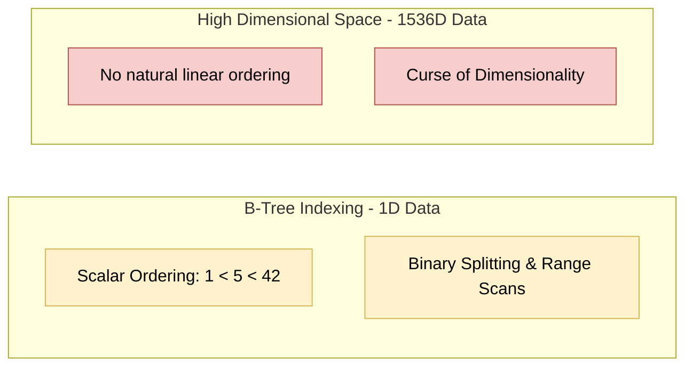

# 01. Vector Database Fundamentals

Vector databases are specialized storage and retrieval engines engineered to handle high-dimensional vector embeddings efficiently.

---

## 1. What are Vector Embeddings?

A **vector embedding** is a dense numerical array (e.g., 384, 768, 1536, or 3072 floating-point numbers) generated by deep learning models (such as Transformers or CNNs).

- Embeddings map complex unstructured data (text, image, audio, video) into a continuous multi-dimensional geometric space.
- **Semantic Proximity**: Semantically similar concepts sit close to each other in vector space.

```
"King"   -> [0.24, -0.81, 0.54, ..., 0.12]
"Queen"  -> [0.22, -0.79, 0.51, ..., 0.15]
"Apple"  -> [-0.65, 0.43, -0.11, ..., -0.88]
```

---

## 2. Mathematical Distance Metrics

Vector similarity is determined by calculating distance or angle between vectors in high-dimensional space.

```mermaid
flowchart TD
    subgraph Metrics [Similarity & Distance Metrics]
        direction TB
        M1[Cosine Similarity <br>&#40;Angular Direction&#41;]
        M2[Euclidean Distance - L2 <br>&#40;Absolute Distance&#41;]
        M3[Dot Product - IP <br>&#40;Magnitude & Angle&#41;]
    end

    classDef metricStyle fill:#e2f0d9,stroke:#385723,stroke-width:1px,color:#000;
    class M1,M2,M3 metricStyle;
```



### A. Cosine Similarity
Measures the cosine of the angle $\theta$ between two vectors, ignoring magnitude.
- Range: $[-1.0, 1.0]$ (or $[0.0, 1.0]$ for non-negative embeddings).
- **Formula**:
  $$\text{Cosine}(\mathbf{A}, \mathbf{B}) = \frac{\mathbf{A} \cdot \mathbf{B}}{\|\mathbf{A}\| \|\mathbf{B}\|} = \frac{\sum_{i=1}^d A_i B_i}{\sqrt{\sum_{i=1}^d A_i^2} \sqrt{\sum_{i=1}^d B_i^2}}$$

### B. Dot Product (Inner Product - IP)
Measures both angle and magnitude.
- **Formula**:
  $$\text{IP}(\mathbf{A}, \mathbf{B}) = \mathbf{A} \cdot \mathbf{B} = \sum_{i=1}^d A_i B_i$$
- **Optimization Tip**: If vectors are normalized to unit length ($\|\mathbf{A}\| = \|\mathbf{B}\| = 1$), Cosine Similarity equals Dot Product! Computing Dot Product is significantly faster because it eliminates square root division.

### C. Euclidean Distance ($L_2$ Distance)
Measures the straight-line distance between two points in Euclidean space.
- Range: $[0, \infty)$ (Lower means more similar).
- **Formula**:
  $$L_2(\mathbf{A}, \mathbf{B}) = \sqrt{\sum_{i=1}^d (A_i - B_i)^2}$$

---

## 3. Metric Comparison Summary

| Metric | Ideal Use Case | Computational Cost | Range |
| :--- | :--- | :--- | :--- |
| **Cosine** | Text similarity, prompt matching | Moderate (Square roots) | $[-1, 1]$ |
| **Dot Product (IP)** | Normalized embeddings, Recommendation | Low (Fused multiply-add) | $(-\infty, \infty)$ |
| **Euclidean ($L_2$)** | Image feature vectors, audio | High (Subtractions + Square) | $[0, \infty)$ |

---

## 4. Why Traditional Databases Fail for Vector Search

Traditional relational (RDBMS) and document databases use scalar indexes such as **B-Trees**, **B+ Trees**, or **LSM-Trees**.



### Major Bottlenecks:

1. **Lack of Natural Ordering**:
   - Scalar data has a total order ($A < B < C$). High-dimensional space ($d=1536$) has no global linear ordering.
2. **Failure of Spatial Indexes (R-Trees / Kd-Trees)**:
   - Spatial trees partition space along axes.
   - When dimensions $d > 20$, the volume of space grows exponentially (**Curse of Dimensionality**). Almost all data points end up at corners/boundaries, causing tree traversal to visit nearly all nodes ($O(N)$ brute force scan).
3. **Brute Force Exhaustive Scan Overhead**:
   - Computing exact $K$-Nearest Neighbors ($K$-NN) requires calculating the distance between query vector $Q$ and all $N$ database vectors.
   - Time Complexity: $O(N \cdot d)$.
   - For 10 million vectors of 1,536 dimensions, a single query requires ~15.3 billion floating-point operations.

To solve this latency nightmare, Vector Databases use **Approximate Nearest Neighbor (ANN)** indexing algorithms, which sacrifice a tiny percentage of recall (accuracy) for 100x–1000x speedups.
