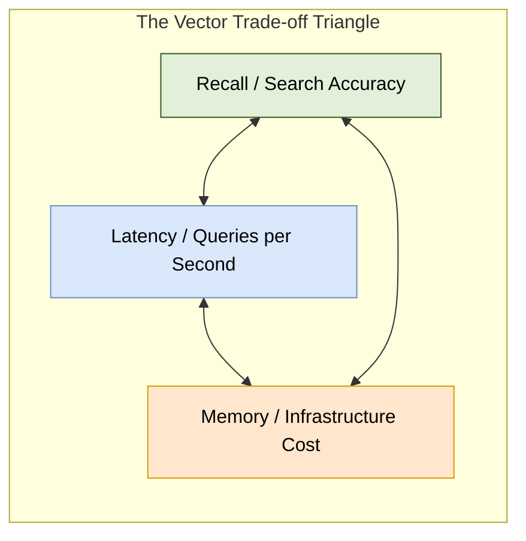
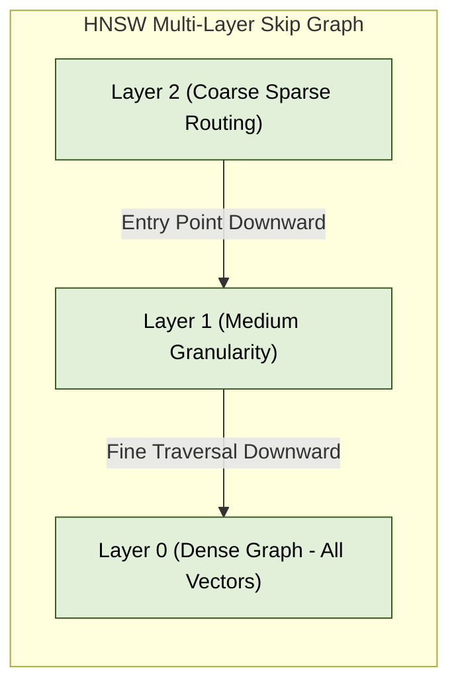

# 02. Vector Indexing & ANN Algorithms

To achieve sub-10 millisecond query latencies across millions or billions of vectors, vector databases employ **Approximate Nearest Neighbor (ANN)** indexing algorithms.

---

## 1. The Vector Trade-off Triangle

Vector indexing requires balancing three competing trade-offs:

> [!TIP]
> **Recall**: The percentage of true nearest neighbors returned compared to a 100% brute-force search. Production systems typically target **95% – 99% recall**.

---

## 2. Taxonomy of Vector Indexes

### A. Flat Index (Brute Force Exact Search)
- **Mechanism**: No indexing structure created. Performs exact distance calculation against every stored vector.
- **Recall**: 100%.
- **Memory**: Minimal overhead (stores raw vectors).
- **Latency**: $O(N \cdot d)$ — degrades linearly with data volume.
- **Best Use Case**: Datasets under 50,000 vectors or baseline accuracy benchmark testing.

---

### B. Inverted File Index (IVF)
- **Mechanism**: Partitions vector space into Voronoi cells using $K$-Means clustering.
  - At index build time: Generates `nlist` cluster centroids.
  - At query time: Identifies nearest centroids and searches vectors only within `nprobe` cells.

```mermaid
flowchart TD
    subgraph IVF [IVF Index Search Flow]
        direction TB
        Q[Query Vector Q] --> C[Find Nearest Centroids <br>&#40;nprobe = 3&#41;]
        C --> V1[Scan Cell 1]
        C --> V2[Scan Cell 2]
        C --> V3[Scan Cell 3]
        V1 --> R[Aggregate Top-K Results]
        V2 --> R
        V3 --> R
    end

    classDef ivfStyle fill:#dae8fc,stroke:#6c8ebf,stroke-width:1px,color:#000;
    class Q,C,V1,V2,V3,R ivfStyle;
```

- **Key Tuning Parameters**:
  - `nlist`: Number of cluster centroids to create. Higher values increase build time.
  - `nprobe`: Number of nearest centroids to inspect during search. Higher `nprobe` increases recall but increases latency.

---

### C. Hierarchical Navigable Small World (HNSW)
HNSW is the industry-standard graph-based index for modern vector search engines (e.g., Qdrant, Milvus, pgvector, Weaviate).

- **Mechanism**: Builds a multi-layer graph inspired by probabilistic skip-lists.
  - **Top Layers**: Sparse graphs with long-range connections for fast routing across vector space.
  - **Bottom Layer (Layer 0)**: Dense graph containing all vectors with short-range local connections.

- **Key Tuning Parameters**:
  - `M`: Maximum number of bi-directional link connections per node (typically `16` to `64`). Higher `M` improves recall for high dimensions at the cost of higher RAM usage.
  - `ef_construction`: Number of candidates evaluated during index build time (typically `64` to `512`).
  - `ef_search`: Number of candidate nodes evaluated during query time (typically `16` to `256`).

---

### D. Vector Quantization (PQ, SQ, ScaNN)
Quantization compresses high-precision floating-point vectors to reduce RAM requirements and accelerate distance calculations via SIMD hardware instructions.

1. **Scalar Quantization (SQ8)**:
   - Converts 32-bit floats (`FP32`) to 8-bit integers (`INT8`).
   - **RAM Reduction**: 4x reduction (e.g., 1,536-dim vector drops from 6,144 bytes to 1,536 bytes).
   - Minimal recall degradation (~98%+ retained).

2. **Product Quantization (PQ)**:
   - Divides a $d$-dimensional vector into $m$ smaller sub-vectors.
   - Clusters sub-vectors into codebooks and replaces raw floats with 1-byte centroid IDs.
   - **RAM Reduction**: Up to 16x – 32x reduction.

3. **ScaNN (Anisotropic Quantization)**:
   - Developed by Google. Quantizes vectors while penalizing directional error, heavily optimizing inner product search accuracy.

---

### E. Disk-Based Graph Indexing (DiskANN / Vamana)
- **Problem**: Full RAM graph indexes (like raw HNSW) are expensive for multi-billion vector scale datasets.
- **Solution**: DiskANN compresses vectors using PQ in RAM while keeping the full adjacency graph on high-speed NVMe SSDs.
- **Performance**: Delivers 95%+ recall with sub-10ms latencies while reducing RAM costs by **70%–80%**.

---

## 3. Algorithm Summary & Selection Matrix

| Index Type | Search Latency | RAM Consumption | Index Build Time | Typical Recall |
| :--- | :--- | :--- | :--- | :--- |
| **Flat** | $O(N)$ (Slow) | Baseline (Raw) | Instant (0s) | 100% |
| **IVF-Flat** | Fast | Medium | Fast | 90% – 95% |
| **HNSW** | Ultra Fast | High (+20%-50% graph) | Slow | 95% – 99% |
| **HNSW + SQ8** | Ultra Fast | Low (25% of HNSW) | Moderate | 94% – 98% |
| **DiskANN** | Fast (NVMe bound) | Extremely Low | Slow | 95% – 98% |
