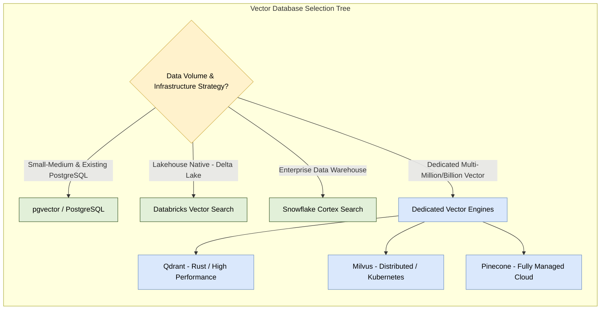
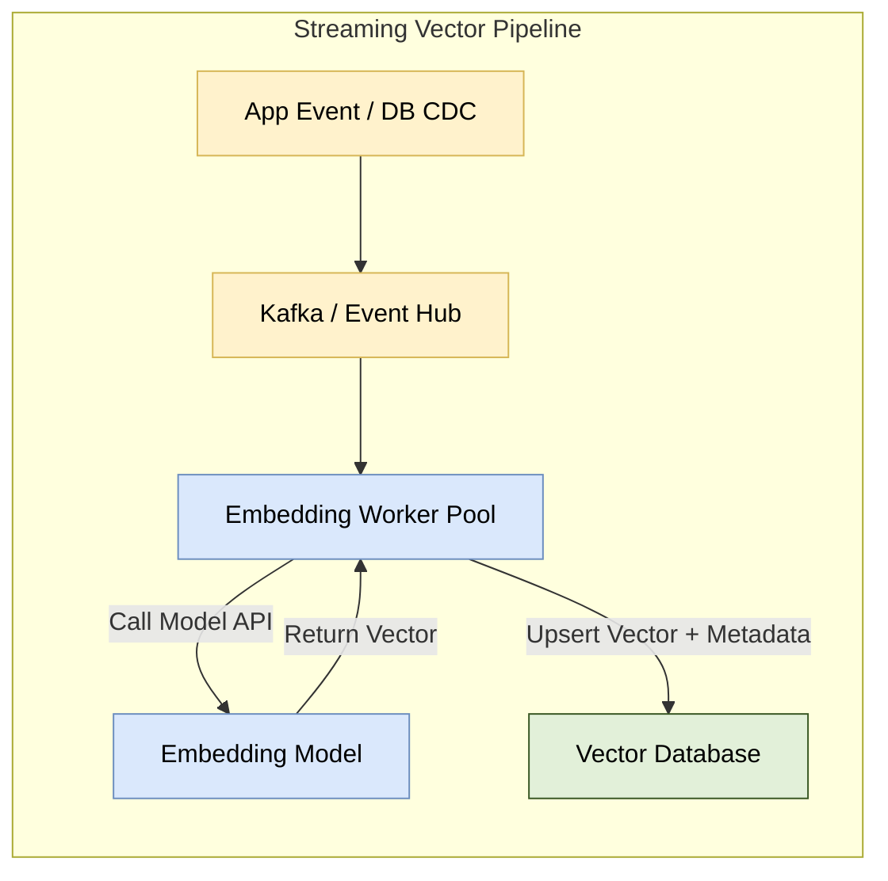
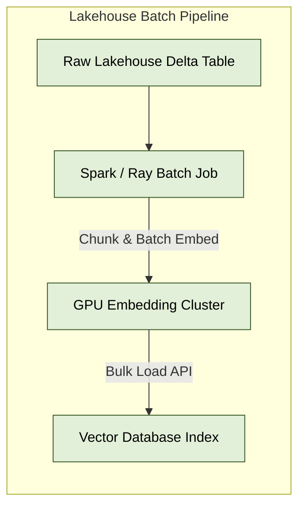

# 03. Data Architect Guide: Infrastructure & Pipeline Design

As a Data Architect, integrating vector databases into enterprise data stacks requires evaluating database selection, sizing memory/storage footprints, establishing ingestion pipelines, and ensuring multi-tenant isolation.

---

## 1. Engine Selection Taxonomy



---

### Comparison: Dedicated vs. Integrated Engines

| Engine Type | Representative Examples | Advantages | Disadvantages |
| :--- | :--- | :--- | :--- |
| **Dedicated Vector DBs** | Qdrant, Milvus, Pinecone, Weaviate | Max QPS, custom ANN indexes, payload-aware graph filtering | Additional DB to operate; data duplication |
| **Relational Extensions** | `pgvector` (Postgres) | Zero new infra, ACID compliance, SQL join support | Memory-bound; graph build costs impact DB CPU |
| **Data Lakehouse / Warehouse** | Databricks Vector Search, Snowflake Cortex | Native sync with Delta/Snowflake tables, auto-indexing | Higher query latency; batch/near-realtime focus |
| **Search Engines** | Elasticsearch, OpenSearch | Strong text/keyword search + vector search | High RAM overhead; complex tuning |

---

## 2. Memory & Capacity Sizing Formulas

Because high-performance ANN indexes (like HNSW) reside in RAM, sizing calculations are critical to budget infrastructure.

### Sizing Formula:
$$\text{RAM}_{\text{total}} = N \times \left( d \times b + M \times 8 \right) \times 1.25 + \text{Metadata}$$

Where:
- $N$: Number of vectors.
- $d$: Dimensions per vector (e.g., 1,536).
- $b$: Bytes per dimension (`4` bytes for FP32 float, `1` byte for SQ8 int8).
- $M$: HNSW graph connections per vector (e.g., `16`).
- $8$: Bytes reserved per graph edge bi-directional pointer.
- $1.25$: 25% safety overhead for buffer memory, garbage collection, and queries.

---

### Real-World Example Sizing: 10 Million Vectors ($d=1536, M=16$)

```
1. Raw Vector Size (FP32):
   10,000,000 * 1,536 * 4 bytes = 61.44 GB

2. HNSW Graph Overhead (M=16):
   10,000,000 * 16 * 8 bytes = 1.28 GB

3. Base Index Total: 62.72 GB

4. With 25% Safety Margin:
   62.72 GB * 1.25 = 78.4 GB RAM

5. With SQ8 Quantization (b=1):
   Raw Vector Size = 15.36 GB
   Total RAM required = ~20.8 GB RAM (73% savings!)
```

---

## 3. Production Ingestion Architectures

### A. Real-Time Streaming Ingestion (CDC & Events)

Used for instant knowledge base updates (e.g., customer support tickets, live news).



---

### B. Batch Lakehouse Ingestion (Delta Lake / Databricks / Spark)

Used for enterprise enterprise document ingestion (PDFs, wiki pages, historical records).



---

## 4. Multi-Tenancy & Metadata Filtering Strategies

In enterprise SaaS, data belonging to Tenant A must never leak to Tenant B.

```mermaid
flowchart TD
    subgraph FilterStrategies [Filtering Architecture Comparison]
        direction TB
        P1["Pre-Filtering: Metadata Filter -> Vector Search <br>&#40;Can break index graph if selectivity is small&#41;"]
        P2["Post-Filtering: Vector Search -> Metadata Filter <br>&#40;May return fewer than K results&#41;"]
        P3["Single-Stage Filtered HNSW Traversal <br>&#40;Recommended: Filter evaluated inside graph walk&#41;"]
    end

    classDef okStyle fill:#e2f0d9,stroke:#385723,stroke-width:1px,color:#000;
    classDef warnStyle fill:#fff2cc,stroke:#d6b656,stroke-width:1px,color:#000;
    class P1,P2 warnStyle;
    class P3 okStyle;
```



### Multi-Tenancy Design Options:

1. **Hard Isolation (Collection per Tenant)**:
   - High security, isolated indexes.
   - **Limit**: DB engines struggle when collection count exceeds 10,000 due to RAM & file descriptor overhead.
2. **Soft Isolation (Payload Metadata Filtering)**:
   - Single collection storing all tenant vectors with payload `{ "tenant_id": "org_123" }`.
   - Requires vector databases with **Single-Stage In-Graph Filtering** (e.g., Qdrant, Milvus) so search algorithms skip non-matching graph nodes without losing graph connectivity.
