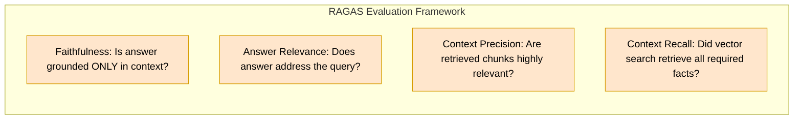

# 04. AI Engineer Guide: Retrieval & RAG Architecture

For AI Engineers, vector databases serve as long-term memory for Large Language Models (LLMs) and core infrastructure for Retrieval-Augmented Generation (RAG).

---

## 1. Embedding Model Selection & MRL

### Dense vs. Sparse Embeddings

```mermaid
flowchart TD
    subgraph EmbeddingTypes [Embedding Paradigms]
        direction TB
        Dense["Dense Embeddings <br>&#40;e.g., OpenAI, Cohere, BGE&#41; <br>- Captures semantic meaning & context"]
        Sparse["Sparse Embeddings <br>&#40;e.g., BM25, SPLADE&#41; <br>- Captures exact keyword matches & domain terms"]
    end

    classDef denseStyle fill:#dae8fc,stroke:#6c8ebf,stroke-width:1px,color:#000;
    classDef sparseStyle fill:#fff2cc,stroke:#d6b656,stroke-width:1px,color:#000;
    class Dense denseStyle;
    class Sparse sparseStyle;
```

---

### Matryoshka Representation Learning (MRL)
Modern models (like OpenAI `text-embedding-3`) use MRL, allowing engineers to truncate vector dimensions without re-training.

- **Example**: `text-embedding-3-large` outputs 3,072 dimensions natively.
- **Truncation**: Can be truncated to **512 dimensions** via vector slicing (`vector[:512]`) and $L_2$-renormalization.
- **Result**: Saves **83% RAM & storage** while retaining ~97% of search accuracy!

---

## 2. Document Chunking Strategies

Chunking transforms raw documents into embedding-ready text blocks.

```mermaid
flowchart TD
    subgraph Chunking [Chunking Strategies]
        direction TB
        C1["Fixed-Size Chunking <br>&#40;512 tokens + 10% overlap&#41;"]
        C2["Semantic Chunking <br>&#40;Splits where sentence vector similarity drops&#41;"]
        C3["Parent-Child Chunking <br>&#40;Embed 128-token child; retrieve 1024-token parent&#41;"]
    end

    classDef cStyle fill:#e2f0d9,stroke:#385723,stroke-width:1px,color:#000;
    class C1,C2,C3 cStyle;
```

> [!TIP]
> **Parent-Child Indexing**: Small chunks produce precise vector matches, but LLMs need surrounding context. Index 128-token child chunks for vector search, but return the 1024-token parent text block to the LLM prompt.

---

## 3. Hybrid Search & Reranking Architecture

Pure vector search struggles with SKU numbers, proper nouns, and specific IDs. **Hybrid Search** combines dense vector search with sparse keyword search.

```mermaid
flowchart TD
    subgraph AdvancedRAG [Hybrid Search & Reranking Pipeline]
        direction TB
        Query[User Query] --> Dense[Dense Vector Search]
        Query --> Sparse[BM25 / Keyword Search]
        
        Dense -->|Top 50 Vectors| RRF[Reciprocal Rank Fusion - RRF]
        Sparse -->|Top 50 Keywords| RRF
        
        RRF -->|Top 30 Candidates| Rerank[Cross-Encoder Reranker <br>&#40;e.g., Cohere Rerank / BGE-Reranker&#41;]
        Rerank -->|Top 5 High-Precision Chunks| LLM[LLM Prompt Context]
    end

    classDef qStyle fill:#fff2cc,stroke:#d6b656,stroke-width:1px,color:#000;
    classDef searchStyle fill:#dae8fc,stroke:#6c8ebf,stroke-width:1px,color:#000;
    classDef rankStyle fill:#e2f0d9,stroke:#385723,stroke-width:1px,color:#000;
    class Query qStyle;
    class Dense,Sparse searchStyle;
    class RRF,Rerank,LLM rankStyle;
```

---

### Reciprocal Rank Fusion (RRF)
RRF merges ranked results from keyword and vector searches without normalizing scores across different scales.

$$\text{RRF\_Score}(d) = \sum_{m \in M} \frac{1}{k + r_m(d)}$$

Where:
- $r_m(d)$ is the rank position of document $d$ in search system $m$.
- $k$ is a smoothing constant (typically $k=60$).

---

## 4. Advanced RAG Query Optimization Patterns

1. **HyDE (Hypothetical Document Embeddings)**:
   - Uses an LLM to generate a hypothetical answer to the user query.
   - Embeds the hypothetical answer (rather than the raw question) to search the vector DB. Improves vector distance matches significantly.
2. **Sub-Query Decomposition**:
   - Complex prompt: *"Compare Q1 sales in NYC vs London"*.
   - Decomposes into two sub-queries:
     1. *"Q1 sales NYC"*
     2. *"Q1 sales London"*
   - Executes parallel vector searches and aggregates context.

---

## 5. RAG Quality Evaluation Metrics (RAGAS Framework)

