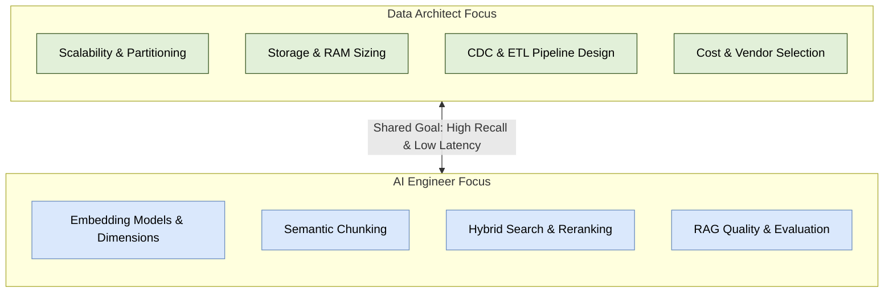

# Vector Databases: Architecture & Engineering Guide

Welcome to the comprehensive guide on **Vector Databases**, curated for **Data Architects** and **AI Engineers**. This documentation covers fundamental vector search theory, index mechanics, database evaluation, production data pipelines, and modern RAG pattern implementations.

---

## 📚 Document Index

| Document | Primary Audience | Key Topics Covered |
| :--- | :--- | :--- |
| [01. Fundamentals](file:///Users/toanbui/dev/data_architect/vector_db/01_fundamentals.md) | All | Vector embeddings, vector spaces, distance metrics, B-Tree limitations |
| [02. Indexing Algorithms](file:///Users/toanbui/dev/data_architect/vector_db/02_indexing_algorithms.md) | AI Engineers / Data Architects | Flat, IVF, HNSW, PQ, ScaNN, DiskANN & performance trade-offs |
| [03. Data Architect Guide](file:///Users/toanbui/dev/data_architect/vector_db/03_data_architect_perspective.md) | Data Architects | Engine selection, memory sizing, batch/stream pipelines, multi-tenancy & cost |
| [04. AI Engineer Guide](file:///Users/toanbui/dev/data_architect/vector_db/04_ai_engineer_perspective.md) | AI Engineers | Embedding models, chunking, Hybrid Search, Reranking, & RAG patterns |

---

## 🎯 Role Comparison Matrix

> [!NOTE]
> All documentation and diagrams in this directory are formatted for readability on standard screens as well as small-screen e-ink devices (e.g., 7 to 8-inch readers).
